# Documentation Structure

**Project**: Bordereau Processing Pipeline  
**Last Updated**: January 21, 2026  
**Version**: 3.5

---

## Overview

This document provides a complete map of all documentation in the Bordereau Processing Pipeline project. All documentation has been consolidated and organized for easy navigation.

---

## Quick Links

### Essential Documents

- **[README.md](README.md)** - Project overview and quick start
- **[QUICK_START.md](QUICK_START.md)** - Getting started guide
- **[docs/IMPLEMENTATION_LOG.md](docs/IMPLEMENTATION_LOG.md)** - Complete project history
- **[docs/README.md](docs/README.md)** - Documentation hub

### Visual Documentation (with Mermaid Diagrams)

- **[docs/DIAGRAMS_GUIDE.md](docs/DIAGRAMS_GUIDE.md)** - How to use diagrams
- **[docs/DATA_FLOW_DIAGRAMS.md](docs/DATA_FLOW_DIAGRAMS.md)** - Data flow visualizations
- **[docs/ARCHITECTURE_DIAGRAMS.md](docs/ARCHITECTURE_DIAGRAMS.md)** - System architecture diagrams

---

## Documentation by Category

### 1. Project Overview

| Document | Description | Location |
|----------|-------------|----------|
| README.md | Project overview, features, tech stack | Root |
| QUICK_START.md | Quick start guide for new users | Root |
| PROJECT_GENERATION_PROMPT.md | Original project generation prompt | Root |
| MIGRATION_GUIDE.md | Migration instructions | Root |

### 2. Implementation History

| Document | Description | Location |
|----------|-------------|----------|
| **IMPLEMENTATION_LOG.md** | **Complete project history** | **docs/** |

**Contents**:
- Initial Deployment
- Hybrid Tables Implementation
- Gold Layer Implementation
- Frontend Features
- Documentation Consolidation
- Container Deployment and TPA Fixes
- Sample Data Generator
- Documentation Reorganization

### 3. Visual Documentation (Mermaid Diagrams)

| Document | Description | Location |
|----------|-------------|----------|
| **DIAGRAMS_GUIDE.md** | How to use Mermaid diagrams | **docs/** |
| **DATA_FLOW_DIAGRAMS.md** | Data flow visualizations | **docs/** |
| **ARCHITECTURE_DIAGRAMS.md** | System architecture diagrams | **docs/** |

**Diagram Types**:
- System architecture
- Data flow (Bronze → Silver → Gold)
- Component interactions
- Deployment architecture
- User workflows

### 4. Technical Documentation

| Document | Description | Location |
|----------|-------------|----------|
| SYSTEM_DESIGN.md | Technical design document | docs/ |
| DEPLOYMENT_AND_OPERATIONS.md | Operations guide | docs/ |

### 5. User Documentation

| Document | Description | Location |
|----------|-------------|----------|
| USER_GUIDE.md | End-user guide | docs/ |
| TPA_COMPLETE_GUIDE.md | TPA management guide | docs/guides/ |

### 6. Deployment Documentation

| Document | Description | Location |
|----------|-------------|----------|
| README.md | Deployment overview | deployment/ |
| QUICK_REFERENCE.md | Quick command reference | deployment/ |
| DEPLOY_SCRIPT_UPDATE.md | Script enhancements | deployment/ |
| SNOWPARK_CONTAINER_DEPLOYMENT.md | SPCS deployment guide | deployment/ |
| SNOWPARK_QUICK_START.md | SPCS quick start | deployment/ |
| DEPLOYMENT_SNOW_CLI.md | Snow CLI deployment guide | deployment/ |
| AUTHENTICATION_SETUP.md | Auth configuration | deployment/ |
| diagnose_service.sh | Diagnostic automation script | deployment/ |

#### Fix Documentation

All fix documentation is organized in `deployment/fixes/`:

| Document | Description | Date |
|----------|-------------|------|
| README.md | Fix documentation index | Jan 21, 2026 |
| CONTAINER_DEPLOYMENT_FIX.md | Drop and recreate strategy | Jan 19, 2026 |
| TROUBLESHOOT_SERVICE_CREATION.md | Service creation failures | Jan 19, 2026 |
| TROUBLESHOOTING_500_ERRORS.md | Resolving 500 errors | Jan 19, 2026 |
| REDEPLOY_WAREHOUSE_FIX.md | Warehouse redeployment | Jan 19, 2026 |
| WAREHOUSE_FIX.md | Warehouse OAuth fix | Jan 19, 2026 |
| TPA_API_FIX.md | TPA API table name fix | Jan 20, 2026 |
| TPA_API_CRUD_FIX.md | TPA API data format fix | Jan 21, 2026 |
| FILE_PROCESSING_FIX.md | File processing improvements | Jan 21, 2026 |
| FILE_PROCESSING_ERROR_INVESTIGATION.md | File processing debugging | Jan 21, 2026 |
| USE_DEFAULT_CONNECTION_FIX.md | Connection prompt fix | Jan 21, 2026 |
| MULTIPLE_CONNECTIONS_FIX.md | Multiple connections handling | Jan 21, 2026 |
| COLOR_OUTPUT_FIX.md | ANSI color rendering | Jan 21, 2026 |

### 7. Layer-Specific Documentation

#### Bronze Layer

| Document | Description | Location |
|----------|-------------|----------|
| README.md | Bronze layer overview | bronze/ |
| TPA_UPLOAD_GUIDE.md | File upload guide | bronze/ |

#### Silver Layer

| Document | Description | Location |
|----------|-------------|----------|
| README.md | Silver layer overview | silver/ |

#### Gold Layer

| Document | Description | Location |
|----------|-------------|----------|
| README.md | Gold layer overview | gold/ |
| HYBRID_TABLES_GUIDE.md | Hybrid tables guide | gold/ |
| PERFORMANCE_OPTIMIZATION_GUIDE.md | Performance optimization | gold/ |
| 6_Member_Journeys.sql | Journey tables (with docs) | gold/ |

### 8. Sample Data Documentation

| Document | Description | Location |
|----------|-------------|----------|
| README.md | Sample data generator guide | sample_data/ |
| generate_sample_data.py | Generator script (with docs) | sample_data/ |
| quick_start.sh | Automation script | sample_data/ |
| load_sample_data.sql | Loading script (with docs) | sample_data/ |

### 9. Backend Documentation

| Document | Description | Location |
|----------|-------------|----------|
| README.md | Backend API documentation | backend/ |

### 10. Testing Documentation

| Document | Description | Location |
|----------|-------------|----------|
| TEST_PLAN_DEPLOYMENT_SCRIPTS.md | Deployment test plan | docs/testing/ |
| README.md | Test documentation | tests/deployment/ |

---

## Documentation Hierarchy

```mermaid
graph TD
    ROOT[bordereau/] --> A[README.md<br/>Project overview]
    ROOT --> B[QUICK_START.md<br/>Getting started]
    ROOT --> C[DOCUMENTATION_STRUCTURE.md<br/>This file]
    ROOT --> D[PROJECT_GENERATION_PROMPT.md<br/>Project history]
    ROOT --> E[MIGRATION_GUIDE.md<br/>Migration guide]
    
    ROOT --> DOCS[docs/<br/>Main documentation]
    DOCS --> DOCS1[README.md<br/>Documentation hub]
    DOCS --> DOCS2[⭐ IMPLEMENTATION_LOG.md<br/>Complete history]
    DOCS --> DOCS3[📊 DIAGRAMS_GUIDE.md<br/>Diagram usage]
    DOCS --> DOCS4[📊 DATA_FLOW_DIAGRAMS.md<br/>Data flow visuals]
    DOCS --> DOCS5[📊 ARCHITECTURE_DIAGRAMS.md<br/>Architecture visuals]
    DOCS --> DOCS6[SYSTEM_DESIGN.md<br/>Technical design]
    DOCS --> DOCS7[DEPLOYMENT_AND_OPERATIONS.md<br/>Operations guide]
    DOCS --> DOCS8[USER_GUIDE.md<br/>User documentation]
    DOCS --> DOCS9[DOCUMENTATION_CLEANUP_SUMMARY.md<br/>Cleanup summary v3.4]
    DOCS --> GUIDES[guides/]
    GUIDES --> GUIDES1[TPA_COMPLETE_GUIDE.md]
    
    ROOT --> DEPLOY[deployment/<br/>Deployment docs]
    DEPLOY --> DEP1[README.md]
    DEPLOY --> DEP2[QUICK_REFERENCE.md]
    DEPLOY --> DEP3[SNOWPARK_CONTAINER_DEPLOYMENT.md]
    DEPLOY --> DEP4[AUTHENTICATION_SETUP.md]
    DEPLOY --> FIXES[fixes/<br/>Fix documentation]
    FIXES --> FIX1[README.md<br/>Fix index]
    FIXES --> FIX2[12 fix documents]
    
    ROOT --> BRONZE[bronze/<br/>Bronze layer docs]
    BRONZE --> BR1[README.md]
    BRONZE --> BR2[TPA_UPLOAD_GUIDE.md]
    
    ROOT --> SILVER[silver/<br/>Silver layer docs]
    SILVER --> SV1[README.md]
    
    ROOT --> GOLD[gold/<br/>Gold layer docs]
    GOLD --> G1[README.md]
    GOLD --> G2[HYBRID_TABLES_GUIDE.md]
    GOLD --> G3[PERFORMANCE_OPTIMIZATION_GUIDE.md]
    
    ROOT --> SAMPLE[sample_data/<br/>Sample data docs]
    SAMPLE --> SM1[README.md]
    SAMPLE --> SM2[generate_sample_data.py]
    
    ROOT --> BACKEND[backend/<br/>Backend docs]
    BACKEND --> BE1[README.md]
    
    ROOT --> TESTS[tests/<br/>Test docs]
    TESTS --> TS1[deployment/README.md]
    
    style ROOT fill:#f9f,stroke:#333,stroke-width:3px
    style DOCS fill:#4caf50,stroke:#333,stroke-width:2px,color:#fff
    style DEPLOY fill:#ff9800,stroke:#333,stroke-width:2px,color:#fff
    style BRONZE fill:#cd7f32,stroke:#333,stroke-width:2px,color:#fff
    style SILVER fill:#c0c0c0,stroke:#333,stroke-width:2px,color:#000
    style GOLD fill:#ffd700,stroke:#333,stroke-width:2px,color:#000
    style SAMPLE fill:#9c27b0,stroke:#333,stroke-width:2px,color:#fff
    style BACKEND fill:#009688,stroke:#333,stroke-width:2px,color:#fff
    style TESTS fill:#2196f3,stroke:#333,stroke-width:2px,color:#fff
```

---

## Summary Statistics

- **Total Documentation Files**: 42
- **Root Level**: 5 files
- **docs/**: 9 files
- **deployment/**: 8 core files + 13 fix files (in fixes/)
- **Layer-specific**: 8 files
- **Backend**: 1 file
- **Sample Data**: 4 files
- **Testing**: 2 files

### Recent Changes

#### v3.5 - Final Consolidation (January 21, 2026)
**Removed Historical Summaries**:
- ✅ Deleted 3 historical summary documents (23 KB)
- ✅ All history now in IMPLEMENTATION_LOG.md
- ✅ Updated all references

#### v3.4 - Major Cleanup (January 21, 2026)
**Removed Duplicates**:
- ✅ Deleted `docs/DATA_FLOW.md` (kept Mermaid version)
- ✅ Deleted `docs/SYSTEM_ARCHITECTURE.md` (kept Mermaid version)
- ✅ Deleted 5 redundant deployment summaries

**Organized Fixes**:
- ✅ Created `deployment/fixes/` subdirectory
- ✅ Moved 12 fix documents to organized location
- ✅ Created fix documentation index

**Total Impact**:
- Reduced redundancy by ~225KB
- Single source of truth for each topic
- Clear organizational hierarchy
- Easier to find and maintain documentation

---

## Finding What You Need

### I want to...

#### Get Started
→ [README.md](README.md) or [QUICK_START.md](QUICK_START.md)

#### See Project History
→ [docs/IMPLEMENTATION_LOG.md](docs/IMPLEMENTATION_LOG.md)

#### Understand the Architecture
→ [docs/ARCHITECTURE_DIAGRAMS.md](docs/ARCHITECTURE_DIAGRAMS.md)

#### Understand Data Flow
→ [docs/DATA_FLOW_DIAGRAMS.md](docs/DATA_FLOW_DIAGRAMS.md)

#### Deploy the Application
→ [deployment/README.md](deployment/README.md)

#### Troubleshoot Deployment
→ [deployment/fixes/README.md](deployment/fixes/README.md) or [deployment/fixes/TROUBLESHOOT_SERVICE_CREATION.md](deployment/fixes/TROUBLESHOOT_SERVICE_CREATION.md)

#### Generate Sample Data
→ [sample_data/README.md](sample_data/README.md)

#### Optimize Performance
→ [gold/PERFORMANCE_OPTIMIZATION_GUIDE.md](gold/PERFORMANCE_OPTIMIZATION_GUIDE.md)

#### Manage TPAs
→ [docs/guides/TPA_COMPLETE_GUIDE.md](docs/guides/TPA_COMPLETE_GUIDE.md)

#### Use Hybrid Tables
→ [gold/HYBRID_TABLES_GUIDE.md](gold/HYBRID_TABLES_GUIDE.md)

#### Upload Files
→ [bronze/TPA_UPLOAD_GUIDE.md](bronze/TPA_UPLOAD_GUIDE.md)

---

## Documentation Standards

### File Naming

- **Descriptive names**: Use clear, descriptive names (e.g., `ARCHITECTURE_DIAGRAMS.md` not `ARCH.md`)
- **UPPERCASE for root**: Root-level docs use UPPERCASE (e.g., `README.md`, `QUICK_START.md`)
- **Category prefixes**: Use prefixes for related docs (e.g., `TPA_*`, `DEPLOYMENT_*`)

### Content Structure

All documentation should include:
1. **Title and metadata** (date, status, version)
2. **Overview** (what this document covers)
3. **Table of contents** (for long documents)
4. **Main content** (well-organized sections)
5. **Examples** (where applicable)
6. **References** (links to related docs)

### Diagram Standards

- Use Mermaid for all diagrams
- Include both diagram code and rendered image
- Provide legend and explanations
- Keep diagrams focused and readable

---

## Maintenance

### Adding New Documentation

1. **Determine category**: Which category does it belong to?
2. **Choose location**: Place in appropriate directory
3. **Follow naming**: Use consistent naming conventions
4. **Update this file**: Add entry to relevant section
5. **Update README**: Add to docs/README.md if major doc

### Updating Documentation

1. **Update content**: Make necessary changes
2. **Update metadata**: Change "Last Updated" date
3. **Update version**: Increment version if major changes
4. **Update IMPLEMENTATION_LOG**: Add entry if significant change

### Deprecating Documentation

1. **Mark as deprecated**: Add deprecation notice at top
2. **Provide alternative**: Link to replacement document
3. **Wait period**: Keep for 30 days
4. **Remove**: Delete after wait period
5. **Update references**: Remove from this file and README

---

## Version History

### v3.1 (January 21, 2026)
- Added recent fix documentation to deployment/
- Updated IMPLEMENTATION_LOG with latest changes
- Moved consolidation doc to docs/
- Updated documentation structure

### v3.0 (January 21, 2026)
- Renamed Mermaid diagram files for clarity
- Consolidated root-level summaries into IMPLEMENTATION_LOG
- Moved feature docs to appropriate directories
- Cleaned up redundant files
- Updated documentation structure

### v2.0 (January 19, 2026)
- Created IMPLEMENTATION_LOG
- Consolidated multiple summary files
- Organized documentation by category

### v1.0 (Initial)
- Created documentation structure
- Established naming conventions
- Set up directory organization

---

## Statistics

**Total Documentation Files**: 52+

**By Category**:
- Root-level: 5 files
- Main docs: 12 files
- Deployment: 19+ files
- Layer-specific: 10 files
- Sample data: 4 files
- Testing: 2 files

**Special Files**:
- **3 files with Mermaid diagrams** 📊
- **1 comprehensive history** (IMPLEMENTATION_LOG)
- **5 essential root files**

---

## Support

For questions about documentation:
1. Check this structure document
2. Review [docs/README.md](docs/README.md)
3. Search [docs/IMPLEMENTATION_LOG.md](docs/IMPLEMENTATION_LOG.md)
4. Check relevant layer/feature README

---

**Last Updated**: January 21, 2026  
**Version**: 3.1  
**Status**: ✅ Current
