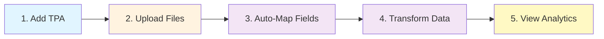

# Bordereau Processing Pipeline

> **AI-powered healthcare claims processing with medallion architecture**

[]()
[]()
[]()
[]()
[]()

**FastAPI + React + Snowflake** | ML/LLM Field Mapping | Multi-Tenant TPA Isolation

---

## 🚀 Quick Start (5 minutes)

```bash
# 1. Install Snowflake CLI
pip install snowflake-cli-labs

# 2. Configure connection (interactive prompt)
snow connection add

# 3. Deploy database layers to Snowflake
cd deployment && ./deploy.sh YOUR_CONNECTION

# 4. Start application locally
cd .. && ./start.sh
```

**🌐 Access**: http://localhost:3000 | **📖 API Docs**: http://localhost:8000/docs

---

## ✨ Key Features

<table>
<tr>
<td width="25%">

### 🥉 Bronze Layer
**Raw Data Ingestion**
- Auto file ingestion
- TPA isolation
- File lifecycle mgmt
- Stage management
- Error handling

</td>
<td width="25%">

### 🥈 Silver Layer
**Data Transformation**
- ML auto-mapping
- LLM semantic mapping
- Data quality rules
- Hybrid tables (10-100x faster)
- Incremental processing

</td>
<td width="25%">

### 🥇 Gold Layer
**Business Analytics**
- Member 360 view
- Provider metrics
- Claims analytics
- Financial summaries
- Quality dashboards

</td>
<td width="25%">

### 💻 Modern UI
**React + TypeScript**
- Real-time updates
- Searchable filters
- Drag & drop upload
- Visual workflows
- Responsive design

</td>
</tr>
</table>

---

## 📐 Architecture

```
┌──────────────┐
│ React (3000) │ TypeScript + Ant Design
└──────┬───────┘
       │ REST API
┌──────▼────────┐
│ FastAPI (8000)│ Python 3.11 + Uvicorn
└──────┬────────┘
       │ Snowflake Connector
┌──────▼─────────────────────┐
│ Snowflake Data Platform    │
│ ┌────────────────────────┐ │
│ │ Bronze (Raw)           │ │ Stages + VARIANT storage
│ └──────┬─────────────────┘ │
│ ┌──────▼─────────────────┐ │
│ │ Silver (Transformed)   │ │ Hybrid tables + indexes
│ └──────┬─────────────────┘ │
│ ┌──────▼─────────────────┐ │
│ │ Gold (Analytics)       │ │ Clustered aggregations
│ └────────────────────────┘ │
└────────────────────────────┘
```

**Multi-Tenancy**: Complete TPA isolation (stages, tables, mappings, rules)

---

## 📚 Documentation

| Document | Description | Audience |
|----------|-------------|----------|
| **[📖 Documentation Index](docs/)** | Central navigation hub | Everyone |
| **[🎓 User Guide](docs/GUIDE.md)** | Complete usage instructions | End users, admins |
| **[🏗️ Architecture](docs/ARCHITECTURE.md)** | Technical design & data model | Developers, architects |
| **[🚀 Quick Start](#-quick-start-5-minutes)** | Get started in 5 minutes | New users |
| **[🆘 Troubleshooting](docs/GUIDE.md#troubleshooting)** | Common issues & solutions | Everyone |

---

## 🔧 Deployment Options

| Environment | Command |
|-------------|---------|
| **Local Dev** | `./start.sh` |
| **Snowflake DB** | `cd deployment && ./deploy.sh CONNECTION` |
| **SPCS Containers** | `./build_and_push_ghcr.sh && cd deployment && ./deploy_container.sh CONNECTION` |

---

## 🆘 Quick Troubleshooting

| Issue | Solution |
|-------|----------|
| Connection fails | `snow connection test YOUR_CONNECTION` |
| Backend errors | Check `backend/config.example.toml`, verify Python 3.10+ |
| Frontend errors | `cd frontend && npm install && npm run dev` |
| Windows paths | Use Git Bash for deployment scripts |
| Tasks not running | `cd deployment && ./deploy.sh CONNECTION` (resume tasks) |

**Full troubleshooting guide**: [docs/GUIDE.md#troubleshooting](docs/GUIDE.md#troubleshooting)

---

## 🎯 Typical Workflow



| Step | Action | Location | Time |
|------|--------|----------|------|
| **1** | Create TPA | Admin → TPA Management | 30 sec |
| **2** | Upload CSV/Excel | Bronze → Upload Files | 1 min |
| **3** | Auto-map fields (ML/LLM) | Silver → Field Mappings | 1 min |
| **4** | Execute transformation | Silver → Transform | 2 min |
| **5** | View analytics | Gold → Analytics Dashboard | 30 sec |

**Total**: ~5 minutes from upload to analytics

---

## 🛠️ Technology Stack

<table>
<tr>
<td>

**Frontend**
- React 18
- TypeScript 5
- Ant Design 5
- Vite 5
- Axios

</td>
<td>

**Backend**
- Python 3.11
- FastAPI
- Uvicorn
- Pydantic
- Snowflake Connector

</td>
<td>

**Database**
- Snowflake
- Hybrid Tables
- Cortex AI
- Snowpark
- Tasks & Streams

</td>
</tr>
</table>

---

## 🌟 Why Bordereau?

| Feature | Benefit |
|---------|---------|
| **AI-Powered Mapping** | 80% reduction in manual mapping time with ML/LLM |
| **Hybrid Tables** | 10-100x faster queries for metadata operations |
| **Multi-Tenancy** | Complete TPA isolation with shared infrastructure |
| **Medallion Architecture** | Industry-standard Bronze/Silver/Gold pattern |
| **Modern Stack** | React + FastAPI + Snowflake = scalable & maintainable |
| **Zero Infrastructure** | Serverless deployment on Snowflake SPCS |

---

## 🤝 Contributing

Contributions welcome! See [docs/GUIDE.md](docs/GUIDE.md) for development setup.

---

## 📄 License

Proprietary - All rights reserved

---

## 📞 Support

- **Documentation**: [docs/](docs/)
- **Issues**: Check [Troubleshooting Guide](docs/GUIDE.md#troubleshooting)
- **Architecture**: See [Architecture Docs](docs/ARCHITECTURE.md)

---

**Version**: 3.3 | **Updated**: February 2026 | **Status**: ✅ Production Ready
