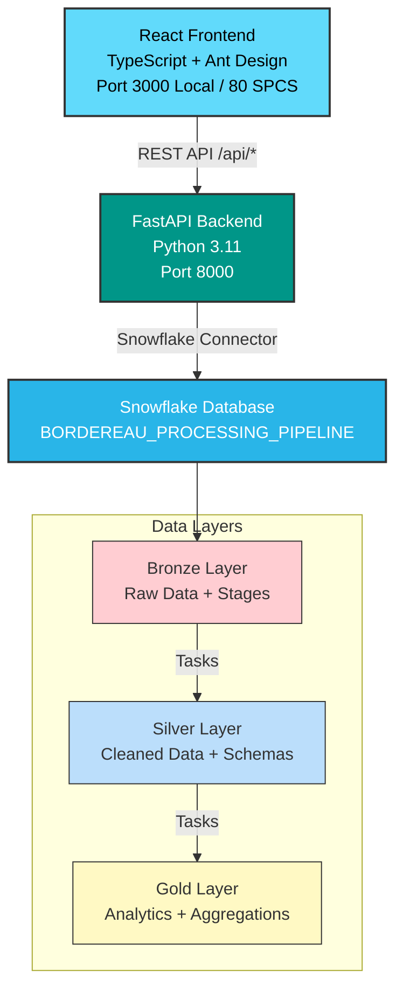
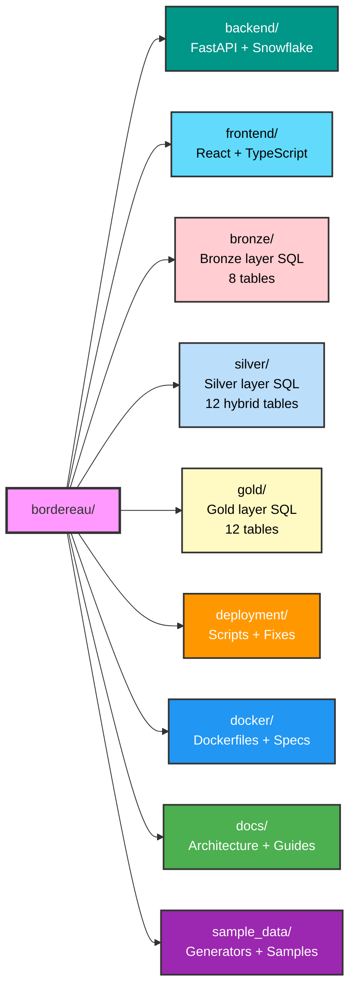

# Bordereau Processing Pipeline

A modern healthcare claims data processing pipeline built with **FastAPI**, **React**, and **Snowflake**.

## 🌟 Key Features

- **Bronze Layer**: Automated file ingestion with TPA-based multi-tenant isolation
- **Silver Layer**: Intelligent data transformation with ML/LLM-powered field mapping
- **Modern UI**: React + TypeScript with Ant Design components
- **Flexible Deployment**: Local, Docker, or Snowpark Container Services
- **Multi-Auth**: Snow CLI, PAT, or Keypair authentication

## 🏗️ Architecture



## 🚀 Quick Start

### 1. Prerequisites
- Python 3.10+, Node.js 18+
- Snowflake account with admin privileges
- Snow CLI installed (recommended)

### 2. Deploy to Snowflake

**Linux/Mac:**
```bash
cd deployment
./deploy.sh  # Deploys Bronze + Silver layers
```

**Windows:**
```cmd
cd deployment
deploy.bat
```

### 3. Start the Application
```bash
./start.sh  # Starts backend + frontend
```

### 4. Access the Application
- **Frontend**: http://localhost:3000
- **Backend API**: http://localhost:8000/api/docs

### 5. Upload Sample Data
1. Open frontend at http://localhost:3000
2. Select a TPA (e.g., `provider_a`)
3. Upload files from `sample_data/claims_data/`
4. Monitor processing in Bronze Status page

**For detailed setup instructions, see [Quick Start Guide](QUICK_START.md)**

## 📖 Documentation

- **[DEPLOY.md](DEPLOY.md)** - Complete deployment guide
- **[Architecture](docs/ARCHITECTURE.md)** - System design and data flow
- **[User Guide](docs/USER_GUIDE.md)** - Application usage
- **[Auto-Mapping Guide](docs/AUTO_MAPPING_GUIDE.md)** - ML/LLM field mapping troubleshooting

## 📦 Deployment Options

### Local Development
**Linux/Mac:**
```bash
./start.sh  # Starts both backend and frontend
```

**Windows:** Start backend and frontend separately in two terminals:
```cmd
REM Terminal 1 - Backend
cd backend
python -m venv venv
venv\Scripts\activate
pip install -r requirements.txt
uvicorn app.main:app --reload

REM Terminal 2 - Frontend
cd frontend
npm install
npm run dev
```

### Snowflake (Bronze + Silver Layers)
**Linux/Mac:**
```bash
cd deployment
./deploy.sh
```

**Windows:**
```cmd
cd deployment
deploy.bat
```

### Snowpark Container Services (Full Stack)
**Linux/Mac:**
```bash
cd deployment
./deploy_container.sh  # Deploys backend + frontend with health checks
```

**Windows:**
```cmd
cd deployment
deploy_container.bat
```

**Features**: 
- ✅ Single command deployment
- ✅ Automated health checks
- ✅ Frontend-backend communication verification
- ✅ Smart updates with zero downtime
- ✅ Endpoint preservation on redeploy

**Alternative**: Deploy services separately (legacy):
```bash
cd deployment/legacy
./deploy_snowpark_container.sh  # Backend only
./deploy_frontend_spcs.sh       # Frontend only
```

**See [deployment/README.md](deployment/README.md) for complete deployment guide**

## 📁 Project Structure




## 🛠️ Development

### Backend
```bash
cd backend
source venv/bin/activate
uvicorn app.main:app --reload
```
**API Docs**: http://localhost:8000/api/docs

### Frontend
```bash
cd frontend
npm install && npm run dev
```
**Access**: http://localhost:3000

## 🔐 Authentication

The backend supports multiple authentication methods:

1. **Snow CLI** (Recommended for dev)
2. **PAT Token** (Recommended for prod)
3. **Keypair** (Most secure)
4. **Environment Variables**

See [backend/README.md](backend/README.md) for setup details.


## 🐛 Troubleshooting

**Backend issues**: Check Snowflake credentials, verify Python 3.10+  
**Frontend issues**: Clear cache, reinstall node_modules  
**Connection issues**: Verify Snow CLI connection with `snow connection test`

**For detailed troubleshooting:**
- [Quick Reference](docs/QUICK_REFERENCE.md) - Common operations and solutions
- [Technical Reference](docs/TECHNICAL_REFERENCE.md) - Advanced troubleshooting
- [Deployment Guide](deployment/README.md) - Deployment troubleshooting
- [Changelog](docs/CHANGELOG.md) - Known issues and recent fixes

## 📝 License

Proprietary software. All rights reserved.

---

**Version**: 3.1 | **Last Updated**: January 31, 2026 | **Status**: ✅ Production Ready
