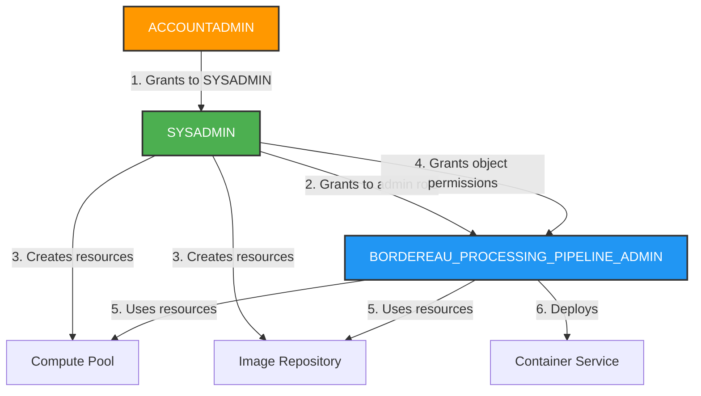

# Container Service Privileges Setup

**Last Updated**: January 23, 2026

## Overview

Snowpark Container Services require specific account-level privileges that can only be granted by `ACCOUNTADMIN`. This document explains the privilege requirements and setup process.

## Privilege Requirements

### Account-Level Privileges (ACCOUNTADMIN Only)

These privileges must be granted **once** by `ACCOUNTADMIN` before deploying containers:

| Privilege | Purpose | Required For |
|-----------|---------|--------------|
| `CREATE COMPUTE POOL` | Create compute pools for container services | Running containers |
| `BIND SERVICE ENDPOINT` | Create public endpoints for services | External access to frontend |

### Object-Level Privileges (SYSADMIN Can Grant)

After compute pools and image repositories are created by `SYSADMIN`, these permissions are granted to the admin role:

| Object | Privileges | Purpose |
|--------|-----------|---------|
| Compute Pool | `USAGE`, `MONITOR`, `OPERATE` | Manage and monitor compute resources |
| Image Repository | `READ`, `WRITE` | Push and pull container images |
| Schema | `CREATE SERVICE` | Deploy container services |

## Setup Process

### Step 1: Grant Account-Level Privileges (One-Time)

**Role Required**: `ACCOUNTADMIN`

```bash
# Run this ONCE before first container deployment
snow sql -f bronze/0_Setup_Container_Privileges.sql \
  --connection DEPLOYMENT \
  -D DATABASE_NAME=BORDEREAU_PROCESSING_PIPELINE
```

**What this does:**
1. `ACCOUNTADMIN` grants privileges to `SYSADMIN`:
   - `CREATE COMPUTE POOL ON ACCOUNT`
   - `BIND SERVICE ENDPOINT ON ACCOUNT`
2. `SYSADMIN` grants privileges to `BORDEREAU_PROCESSING_PIPELINE_ADMIN`:
   - `CREATE COMPUTE POOL ON ACCOUNT`
   - `BIND SERVICE ENDPOINT ON ACCOUNT`

### Step 2: Deploy Containers

**Role Required**: `SYSADMIN` (for resource creation) + `BORDEREAU_PROCESSING_PIPELINE_ADMIN` (for service deployment)

```bash
cd deployment
./deploy_container.sh
```

**What this does:**
1. Uses `SYSADMIN` to create compute pool
2. Uses `SYSADMIN` to grant permissions on compute pool to admin role
3. Uses `SYSADMIN` to create image repository
4. Uses `SYSADMIN` to grant permissions on image repository to admin role
5. Uses admin role to build and push images
6. Uses admin role to deploy service

## Architecture

### Privilege Hierarchy



### Why This Approach?

1. **Proper Privilege Hierarchy**: `ACCOUNTADMIN` → `SYSADMIN` → Admin Role
2. **Security**: Account-level privileges flow through proper channels
3. **Separation of Duties**: Resource creation by `SYSADMIN`, service deployment by admin role
4. **Least Privilege**: Admin role only gets necessary permissions, not full account access
5. **One-Time Setup**: Account-level privileges granted once, not in every deployment
6. **Standard Practice**: Follows Snowflake's recommended privilege delegation pattern

## Verification

### Check Account-Level Privileges

```sql
-- Check SYSADMIN privileges
USE ROLE ACCOUNTADMIN;
SHOW GRANTS TO ROLE SYSADMIN;

-- Check admin role privileges
SHOW GRANTS TO ROLE BORDEREAU_PROCESSING_PIPELINE_ADMIN;
```

Look for in both roles:
- `CREATE COMPUTE POOL ON ACCOUNT`
- `BIND SERVICE ENDPOINT ON ACCOUNT`

### Check Object-Level Privileges

```sql
USE ROLE SYSADMIN;

-- Check compute pool permissions
SHOW GRANTS ON COMPUTE POOL BORDEREAU_COMPUTE_POOL;

-- Check image repository permissions
SHOW GRANTS ON IMAGE REPOSITORY BORDEREAU_REPOSITORY;
```

## Troubleshooting

### Error: "Compute pool does not exist or operation not authorized"

**Cause**: Account-level privileges not granted

**Solution**: Run `bronze/0_Setup_Container_Privileges.sql` with `ACCOUNTADMIN`

### Error: "Insufficient privileges to operate on compute pool"

**Cause**: Object-level permissions not granted by `SYSADMIN`

**Solution**: The `deploy_container.sh` script handles this automatically. If manual fix needed:

```sql
USE ROLE SYSADMIN;

GRANT USAGE ON COMPUTE POOL BORDEREAU_COMPUTE_POOL 
    TO ROLE BORDEREAU_PROCESSING_PIPELINE_ADMIN;
GRANT MONITOR ON COMPUTE POOL BORDEREAU_COMPUTE_POOL 
    TO ROLE BORDEREAU_PROCESSING_PIPELINE_ADMIN;
GRANT OPERATE ON COMPUTE POOL BORDEREAU_COMPUTE_POOL 
    TO ROLE BORDEREAU_PROCESSING_PIPELINE_ADMIN;
```

### Error: "Insufficient privileges to create service"

**Cause**: `CREATE SERVICE` privilege not granted on schema

**Solution**: The `deploy_container.sh` script handles this automatically. If manual fix needed:

```sql
USE ROLE SYSADMIN;

GRANT CREATE SERVICE ON SCHEMA BORDEREAU_PROCESSING_PIPELINE.PUBLIC 
    TO ROLE BORDEREAU_PROCESSING_PIPELINE_ADMIN;
```

### Error: "SYSADMIN does not have CREATE COMPUTE POOL privilege"

**Cause**: Account-level privileges not granted to SYSADMIN first

**Solution**: Run the setup script which grants to SYSADMIN first:

```bash
snow sql -f bronze/0_Setup_Container_Privileges.sql \
    --connection DEPLOYMENT \
    -D DATABASE_NAME=BORDEREAU_PROCESSING_PIPELINE
```

## Related Documentation

- [Deployment Guide](README.md) - Main deployment documentation
- [Snowpark Container Deployment](SNOWPARK_CONTAINER_DEPLOYMENT.md) - Detailed container deployment guide
- [Authentication Setup](AUTHENTICATION_SETUP.md) - Authentication configuration

## Files

| File | Purpose | Role Required |
|------|---------|---------------|
| `bronze/0_Setup_Container_Privileges.sql` | Grant account-level privileges | ACCOUNTADMIN |
| `bronze/1_Setup_Database_Roles.sql` | Create roles and database | SYSADMIN |
| `deployment/deploy_container.sh` | Deploy container services | SYSADMIN + Admin |

## Summary

1. ✅ **One-time setup**: Run `0_Setup_Container_Privileges.sql` with `ACCOUNTADMIN`
   - Grants privileges to `SYSADMIN` first
   - Then `SYSADMIN` grants to admin role
2. ✅ **Deploy containers**: Run `deploy_container.sh` (uses `SYSADMIN` for resources, admin role for services)
3. ✅ **No ACCOUNTADMIN needed** for regular deployments after initial setup
4. ✅ **Proper privilege hierarchy**: ACCOUNTADMIN → SYSADMIN → Admin Role
