# Deployment Guide

Complete deployment documentation for the Bordereau Processing Pipeline.

> **📖 For complete documentation, see [docs/README.md](../docs/README.md)**

## Directory Structure


## Quick Start

> **💻 Windows Users:** 
> - Full Guide: [WINDOWS_DEPLOYMENT.md](WINDOWS_DEPLOYMENT.md)
> - Quick Commands: [WINDOWS_QUICK_REFERENCE.md](WINDOWS_QUICK_REFERENCE.md)

### 1. Deploy to Snowflake (Bronze + Silver + Gold Layers)

**Linux/Mac:**
```bash
cd deployment
./deploy.sh
```

**Windows:**
```cmd
cd deployment
deploy.bat
```

**What gets deployed:**
- ✅ Bronze Layer (raw data ingestion)
- ✅ Silver Layer (transformed data)
- ✅ Gold Layer (analytics-ready data) ⚡ **with 88% faster bulk load optimization**
- ❓ Optional: Snowpark Container Services (prompted)

### 2. Deploy Container Services to SPCS (Recommended)

#### Prerequisites (One-Time Setup)

**IMPORTANT:** Before deploying containers for the first time, you must grant account-level privileges using ACCOUNTADMIN:

```bash
# Run this ONCE with ACCOUNTADMIN role
snow sql -f bronze/0_Setup_Container_Privileges.sql \
  --connection DEPLOYMENT \
  -D DATABASE_NAME=BORDEREAU_PROCESSING_PIPELINE
```

This grants the admin role permission to create compute pools and bind service endpoints.

#### Deploy Services

Deploy both backend and frontend services:

**Linux/Mac:**
```bash
cd deployment
./deploy_container.sh
```

**Windows:**
```cmd
cd deployment
deploy_container.bat
```

**This is the recommended approach** - unified deployment, backend internal-only, more secure.

This single command will:
1. ✅ Deploy backend service (FastAPI)
2. ✅ Verify backend health
3. ✅ Deploy frontend service (React + Nginx)
4. ✅ Verify frontend accessibility
5. ✅ Test frontend-backend communication
6. ✅ Provide both endpoints

**Complete Stack in SPCS:**
- ✅ Frontend (React + Nginx)
- ✅ Backend (FastAPI)
- ✅ Both with public HTTPS endpoints
- ✅ Internal API proxying (no CORS)
- ✅ Automated health checks
- ✅ Communication verification

### Alternative: Deploy Services Separately

### 3. Manage the Unified Service

```bash
cd deployment

# View status
./manage_services.sh status

# View logs
./manage_services.sh logs backend 100
./manage_services.sh logs frontend 50

# Run health checks
./manage_services.sh health

# Restart service
./manage_services.sh restart all
```

## Legacy: Separate Services

For backward compatibility, legacy scripts for separate service deployment are in `legacy/`:

```bash
cd deployment/legacy

# Deploy as separate services (not recommended)
./deploy_full_stack.sh
./deploy_snowpark_container.sh  # Backend only
./deploy_frontend_spcs.sh       # Frontend only
```

**See [`legacy/README.md`](legacy/README.md) for details and migration guide.**

### 4. Manage the Services

**Unified Management (Recommended):**

The `manage_services.sh` script provides comprehensive management for all Snowpark services:

```bash
cd deployment

# Status and Information
./manage_services.sh status              # Both services status
./manage_services.sh status backend      # Backend only
./manage_services.sh status frontend     # Frontend only
./manage_services.sh endpoints           # Show all HTTPS endpoints
./manage_services.sh health              # Run health checks on all services
./manage_services.sh all                 # Complete overview (status + endpoints + health)

# View Logs
./manage_services.sh logs backend 50     # Backend logs (last 50 lines)
./manage_services.sh logs frontend 100   # Frontend logs (last 100 lines)
./manage_services.sh logs all 20         # Both services (20 lines each)

# Service Control
./manage_services.sh restart backend     # Restart backend service
./manage_services.sh restart frontend    # Restart frontend service
./manage_services.sh restart all         # Restart both services
./manage_services.sh suspend backend     # Suspend backend
./manage_services.sh suspend frontend    # Suspend frontend
./manage_services.sh resume backend      # Resume backend
./manage_services.sh resume all          # Resume both services

# Update with New Images
./manage_services.sh restart-image backend   # Update backend with new image
./manage_services.sh restart-image frontend  # Update frontend with new image
./manage_services.sh restart-image all       # Update both services

# Troubleshooting
./manage_services.sh describe backend    # Detailed service info
./manage_services.sh describe frontend   # Detailed service info
```

**Quick Reference:**
- `status` - Check if services are running
- `endpoints` - Get HTTPS URLs
- `health` - Test all endpoints
- `logs` - View recent logs
- `restart` - Restart service
- `restart-image` - Update and restart with new image
- `all` - Show everything at once

**Individual Service Management (Legacy):**

Backend:
```bash
./manage_snowpark_service.sh status      # Show status
./manage_snowpark_service.sh logs 100    # Show logs
./manage_snowpark_service.sh restart     # Restart
```

Frontend:
```bash
./manage_frontend_service.sh status      # Show status
./manage_frontend_service.sh logs 100    # Show logs
./manage_frontend_service.sh restart     # Restart
```

## Configuration

### Default Configuration

Edit `deployment/default.config` to set default values:

```bash
# Snowflake Configuration
SNOWFLAKE_ACCOUNT="SFSENORTHAMERICA-TBOON_AWS2"
SNOWFLAKE_WAREHOUSE="COMPUTE_WH"
DATABASE_NAME="BORDEREAU_PROCESSING_PIPELINE"
BRONZE_SCHEMA_NAME="BRONZE"
SILVER_SCHEMA_NAME="SILVER"
```

### Custom Configuration

Create `deployment/custom.config` to override defaults:

```bash
cp deployment/custom.config.example deployment/custom.config
# Edit custom.config with your values
```

## Full Stack Deployment Details

### Architecture

When you deploy the full stack to Snowpark Container Services, you get:

```mermaid
graph TD
    A[User's Browser] -->|HTTPS| B[Frontend Service SPCS<br/>━━━━━━━━━━━━━━━<br/>• React App Static Files<br/>• Nginx Proxy<br/>• Routes /api/* → Backend<br/>Public: https://frontend-xxx.app]
    B -->|Internal HTTPS| C[Backend Service SPCS<br/>━━━━━━━━━━━━━━━<br/>• FastAPI REST API<br/>• Snowflake Connector<br/>• SPCS OAuth Authentication<br/>Internal: https://backend-xxx.app]
    C --> D[Snowflake Database<br/>━━━━━━━━━━━━━━━<br/>• Bronze Layer<br/>• Silver Layer]
    
    style A fill:#fff,stroke:#333,stroke-width:2px
    style B fill:#61dafb,stroke:#333,stroke-width:2px,color:#000
    style C fill:#009688,stroke:#333,stroke-width:2px,color:#fff
    style D fill:#29b5e8,stroke:#333,stroke-width:2px,color:#fff
```



**Key Benefits:**
- ✅ Single public endpoint for users (frontend)
- ✅ Internal API communication (no CORS issues)
- ✅ Automatic HTTPS for both services
- ✅ Snowflake-native authentication
- ✅ No external infrastructure needed

### Deployment Process

The `deploy_full_stack.sh` script performs these steps:

1. **Backend Deployment**
   - Builds FastAPI Docker image
   - Pushes to Snowflake image repository
   - Creates/updates backend service
   - Waits for service to be ready

2. **Backend Health Check**
   - Tests `/api/health` endpoint
   - Verifies Snowflake connection
   - Ensures API is responding

3. **Frontend Deployment**
   - Builds React + Nginx Docker image
   - Configures Nginx to proxy to backend
   - Pushes to Snowflake image repository
   - Creates/updates frontend service

4. **Frontend Verification**
   - Tests frontend accessibility
   - Verifies static assets load
   - Checks Nginx configuration

5. **Communication Test**
   - Tests frontend → backend API calls
   - Verifies end-to-end connectivity
   - Confirms full stack is operational

**Typical Deployment Time:** 5-8 minutes

## Deployment Features

### Smart Service Updates

The deployment scripts include smart update logic:

**First Deployment:**
- Creates compute pool
- Creates image repository
- Builds and pushes Docker image
- Creates new service
- Generates new endpoint

**Subsequent Deployments:**
- Reuses existing compute pool and repository
- Builds and pushes new Docker image
- **Updates existing service** (preserves endpoint!)
- Suspends → Updates spec → Resumes service
- No endpoint change, no downtime during update

### Benefits

✅ **Endpoint Preservation** - Your endpoint URLs never change  
✅ **Zero Configuration** - Automatically detects existing services  
✅ **Fast Updates** - Only rebuilds and updates what changed  
✅ **Safe Rollback** - Previous image versions remain in repository  
✅ **Health Verification** - Automated health checks after deployment  
✅ **Communication Testing** - Verifies frontend-backend connectivity

## Individual Service Deployment

### Backend Only Deployment

Deploy just the FastAPI backend:

```bash
cd deployment
./deploy_snowpark_container.sh
```

**What it does:**
- Creates compute pool (if needed)
- Creates image repository (if needed)
- Builds backend Docker image
- Pushes to Snowflake registry
- Creates/updates backend service
- Returns backend HTTPS endpoint

**Use when:**
- Testing backend changes
- Backend-only updates
- Initial backend setup

### Frontend Only Deployment

Deploy just the React frontend:

```bash
cd deployment
./deploy_frontend_spcs.sh
```

**Prerequisites:**
- Backend must be deployed first
- Backend endpoint must be accessible

**What it does:**
- Builds React application
- Configures Nginx proxy to backend
- Builds frontend Docker image
- Pushes to Snowflake registry
- Creates/updates frontend service
- Returns frontend HTTPS endpoint

**Use when:**
- UI changes only
- Frontend configuration updates
- Testing frontend independently  

## Scripts Overview

### Main Deployment Scripts

- **`deploy.sh`** - Master deployment script for Bronze and Silver layers
- **`deploy_bronze.sh`** - Deploys Bronze layer (stages, tables, procedures, tasks)
- **`deploy_silver.sh`** - Deploys Silver layer (schemas, mappings, transformations)
- **`deploy_snowpark_container.sh`** - Deploys backend to Snowpark Container Services

### Management Scripts

- **`manage_snowpark_service.sh`** - Comprehensive service management
  - Status checking
  - Log viewing
  - Endpoint retrieval
  - Start/Stop/Restart operations

### Setup Scripts

- **`setup_keypair_auth.sh`** - Interactive keypair authentication setup
- **`check_snow_connection.sh`** - Verify Snow CLI connection
- **`undeploy.sh`** - Remove all deployed resources

### Configuration Files

- **`default.config`** - Default configuration values
- **`custom.config.example`** - Template for custom configuration
- **`configure_keypair_auth.sql`** - SQL commands for keypair setup

## Additional Documentation

For more detailed information on specific topics:

| Document | Description |
|----------|-------------|
| [DEPLOYMENT_SNOW_CLI.md](DEPLOYMENT_SNOW_CLI.md) | Detailed Snow CLI setup and usage |
| [SNOWPARK_CONTAINER_DEPLOYMENT.md](SNOWPARK_CONTAINER_DEPLOYMENT.md) | In-depth container deployment guide |
| [SNOWPARK_QUICK_START.md](SNOWPARK_QUICK_START.md) | Quick reference for Snowpark services |
| [AUTHENTICATION_SETUP.md](AUTHENTICATION_SETUP.md) | Authentication methods and configuration |
| [DEPLOYMENT_SUMMARY.md](DEPLOYMENT_SUMMARY.md) | Deployment checklist and verification |

**Note:** The main deployment guide (this file) contains all essential information. The additional documents provide deeper technical details for specific scenarios.

## Path References

All scripts in this directory automatically reference the correct paths:

- **Project Root:** `../` (parent directory)
- **Bronze SQL:** `../bronze/*.sql`
- **Silver SQL:** `../silver/*.sql`
- **Docker Files:** `../docker/Dockerfile.backend`
- **Logs:** `../logs/`

## Examples

### Full Deployment

```bash
# Deploy everything
cd deployment
./deploy.sh

# Deploy container service
./deploy_snowpark_container.sh

# Check service status
./manage_snowpark_service.sh status
```

### Update Container Image

```bash
# Make code changes in backend/app/
# Then redeploy (endpoint will be preserved!)
cd deployment
./deploy_snowpark_container.sh
```

### View Service Logs

```bash
cd deployment
./manage_snowpark_service.sh logs 200
```

### Get Service Endpoint

```bash
cd deployment
./manage_snowpark_service.sh endpoint
```

## Troubleshooting

### Service Won't Start

```bash
# Check service status
./manage_snowpark_service.sh status

# View logs
./manage_snowpark_service.sh logs 100

# Check compute pool
snow sql -q "DESCRIBE COMPUTE POOL BORDEREAU_COMPUTE_POOL" --connection DEPLOYMENT
```

### Endpoint Not Available

The endpoint may take 2-3 minutes to provision after service creation. Check again:

```bash
./manage_snowpark_service.sh endpoint
```

### Authentication Issues

```bash
# Test connection
./check_snow_connection.sh

# Setup keypair auth
./setup_keypair_auth.sh
```

## Important Notes

- ✅ All scripts should be run from the `deployment/` directory
- ✅ Scripts automatically handle path resolution to project files
- ✅ Configuration files are loaded in order: default.config → custom.config → command line args
- ✅ Service updates preserve endpoints (no URL changes on redeploy)

## Performance Optimizations

### Gold Layer Bulk Load ⚡

The deployment now uses an optimized bulk INSERT approach for Gold layer schema loading:

**Benefits:**
- ⚡ **88% fewer operations** (69 → 8 database calls)
- ⚡ **85% faster execution** (~15-20s → ~2-3s)
- 📊 **90% cleaner output** (200+ → 20 lines)
- 🔧 **More maintainable** (4 bulk inserts vs 65 procedure calls)

**Implementation:**
- `deploy_gold.sh` uses `gold/2_Gold_Target_Schemas_BULK.sql`
- Original version still available: `gold/2_Gold_Target_Schemas.sql`
- See [gold/BULK_LOAD_OPTIMIZATION.md](../gold/BULK_LOAD_OPTIMIZATION.md) for details

### Container Deployment Integration

The main `deploy.sh` script includes optional container deployment:
- Prompts after database layers are deployed
- Can be skipped for database-only deployment
- Fully automated with `AUTO_APPROVE=true`
- See [DEPLOY_SCRIPT_IMPROVEMENTS.md](DEPLOY_SCRIPT_IMPROVEMENTS.md) for details

## Task Management

### Automatic Task Resumption

By default, tasks are **automatically resumed** after deployment. This is controlled by the `AUTO_RESUME_TASKS` configuration variable in `default.config`.

### Bronze Layer Tasks

The Bronze layer includes 5 automated tasks:

1. **discover_files_task** (root) - Scans `@SRC` stage every 60 minutes
2. **process_files_task** - Processes pending files (batch of 10)
3. **move_successful_files_task** - Moves completed files to `@COMPLETED`
4. **move_failed_files_task** - Moves failed files to `@ERROR` (after 3 retries)
5. **archive_old_files_task** - Archives files older than 30 days (daily at 2 AM)

### Manual Task Control

**Resume Bronze Tasks:**
```bash
snow sql -f deployment/resume_tasks.sql --connection <CONNECTION_NAME>
```

**Suspend Bronze Tasks:**
```sql
USE DATABASE BORDEREAU_PROCESSING_PIPELINE;
USE SCHEMA BRONZE;

-- Suspend in reverse order (root first, then children)
ALTER TASK discover_files_task SUSPEND;
ALTER TASK process_files_task SUSPEND;
ALTER TASK move_successful_files_task SUSPEND;
ALTER TASK move_failed_files_task SUSPEND;
ALTER TASK archive_old_files_task SUSPEND;
```

**Check Task Status:**
```sql
SHOW TASKS IN SCHEMA BRONZE;
```

**Manually Trigger Processing:**
```sql
CALL BRONZE.process_queued_files();
```

### Gold Layer Tasks

Resume Gold tasks after deployment:
```bash
snow sql -f deployment/resume_gold_tasks.sql --connection <CONNECTION_NAME>
```

### Important Notes

⚠️ **Task Resumption Order**: When resuming tasks with dependencies, you MUST resume them in the correct order:
1. Resume child tasks first (bottom-up)
2. Resume root task last

This is because Snowflake requires all child tasks to be in a consistent state before resuming the root task.

### Troubleshooting Tasks

**Files Stuck in PENDING:**
```bash
# Resume tasks
snow sql -f deployment/resume_tasks.sql --connection <CONNECTION_NAME>

# Manually process
snow sql -q "CALL BRONZE.process_queued_files();" --connection <CONNECTION_NAME>
```

**View Task History:**
```sql
SELECT * FROM TABLE(INFORMATION_SCHEMA.TASK_HISTORY())
WHERE SCHEMA_NAME = 'BRONZE'
ORDER BY SCHEDULED_TIME DESC
LIMIT 10;
```

## Related Documentation

- [Documentation Hub](../docs/README.md) - Complete documentation index
- [Quick Start Guide](../QUICK_START.md) - Get running in 10 minutes
- [Backend README](../backend/README.md) - Backend API documentation
- [User Guide](../docs/USER_GUIDE.md) - Usage instructions
- [Gold Layer README](../gold/README.md) - Gold layer and performance optimization

---

**Version**: 2.1 | **Last Updated**: January 27, 2026 | **Status**: ✅ Production Ready
