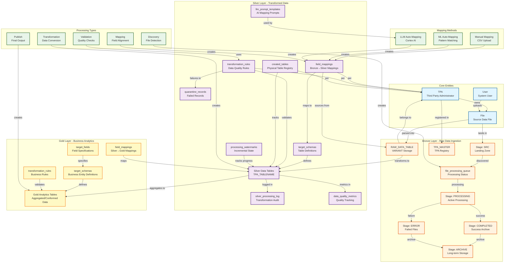

# Bordereau Processing Pipeline - Application Ontology

## Mermaid Diagram

## Entity Descriptions

### Core Entities

**TPA (Third Party Administrator)**
- Primary organizational dimension
- All data is partitioned by TPA
- Registered in TPA_MASTER table

**User**
- System users who interact with the application
- Create mappings, upload files, manage schemas

**File**
- Source data files (CSV, Excel)
- Organized by TPA in stage folders
- Tracked through processing lifecycle

### Bronze Layer - Raw Data Ingestion

**Stages**
- `SRC`: Landing zone for incoming files
- `PROCESSING`: Files being actively processed
- `COMPLETED`: Successfully processed files (30-day retention)
- `ERROR`: Failed files (30-day retention)
- `ARCHIVE`: Long-term storage

**RAW_DATA_TABLE**
- Stores raw records as VARIANT (JSON)
- One row per source file record
- Clustered by TPA, FILE_NAME, LOAD_TIMESTAMP

**file_processing_queue**
- Tracks file processing status
- States: PENDING → PROCESSING → SUCCESS/FAILED

**TPA_MASTER**
- Registry of valid TPAs
- Reference data for all TPA codes

### Silver Layer - Transformed Data

**target_schemas**
- TPA-agnostic table definitions
- Shared schema across all TPAs
- Defines structure for Silver tables

**field_mappings**
- Bronze → Silver field mappings
- TPA-specific mappings
- Methods: MANUAL, ML_AUTO, LLM_CORTEX
- Includes transformation logic and confidence scores

**transformation_rules**
- Data quality and business rules
- Types: DATA_QUALITY, BUSINESS_LOGIC, STANDARDIZATION, DEDUPLICATION, REFERENTIAL_INTEGRITY
- Actions: REJECT, QUARANTINE, FLAG, CORRECT

**created_tables**
- Registry of physical Silver tables
- Format: {TPA}_{TABLE_NAME} (e.g., PROVIDER_A_DENTAL_CLAIMS)

**silver_processing_log**
- Audit trail for transformations
- Tracks batch processing metrics

**data_quality_metrics**
- Quality measurements per batch
- Pass/fail thresholds

**quarantine_records**
- Records that failed validation
- Stored for review and reprocessing

**processing_watermarks**
- Incremental processing state
- Tracks last processed record

**llm_prompt_templates**
- AI prompts for LLM-based field mapping
- Used by Cortex AI

### Gold Layer - Business Analytics

**target_schemas**
- Business entity definitions
- Analytics-ready table structures

**target_fields**
- Field specifications with business definitions
- Calculation logic for measures

**field_mappings**
- Silver → Gold aggregation mappings

**transformation_rules**
- Business rules and validations

**Gold Tables**
- Final analytics tables
- Aggregated and conformed data

## Data Flow

1. **Ingestion**: Files uploaded to Bronze SRC stage
2. **Discovery**: Files detected and queued
3. **Parsing**: Files parsed into RAW_DATA_TABLE
4. **Mapping**: Fields mapped using Manual/ML/LLM methods
5. **Transformation**: Raw data transformed to Silver tables
6. **Validation**: Quality rules applied
7. **Quarantine**: Failed records isolated
8. **Aggregation**: Silver data aggregated to Gold layer
9. **Publishing**: Final analytics tables available

## Key Relationships

- **TPA is the primary dimension** - All data is partitioned by TPA
- **Schemas are shared, tables are per-TPA** - One schema definition, multiple physical tables
- **Mappings are TPA-specific** - Each TPA has its own field mappings
- **Rules are TPA-specific** - Data quality rules per TPA
- **Three mapping methods** - Manual, ML pattern matching, LLM semantic understanding
- **Cascading deletes** - Deleting tables removes associated mappings and rules
