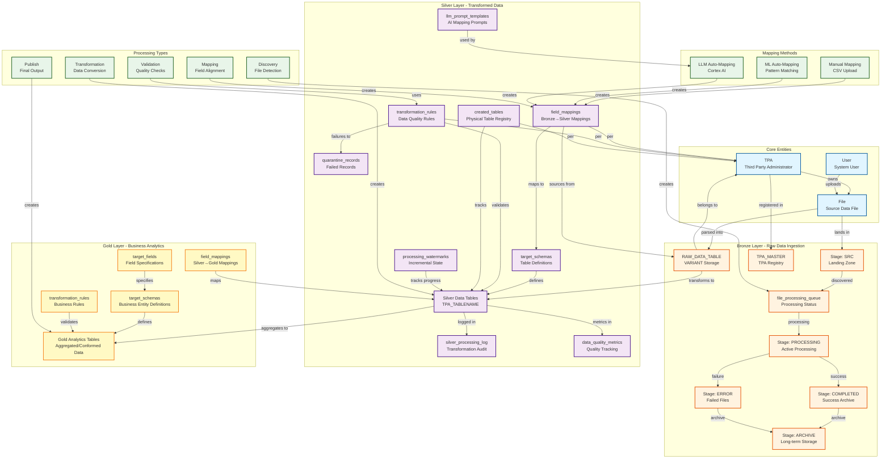

# Architecture and Data Model

Visual reference for system architecture, data entities, and relationships.

---

## System Architecture Diagram



---

## Entity Reference

### Core Entities

| Entity | Purpose | Key Attributes |
|--------|---------|----------------|
| **TPA** | Third Party Administrator - primary organizational dimension | `tpa_code`, `tpa_name`, `description` |
| **User** | System users who manage data and mappings | `user_id`, `username`, `role` |
| **File** | Source data files (CSV, Excel) | `file_name`, `tpa_code`, `upload_timestamp` |

### Bronze Layer - Raw Data Ingestion

| Entity | Purpose | Retention |
|--------|---------|-----------|
| **Stage: SRC** | Landing zone for incoming files | Until processed |
| **Stage: PROCESSING** | Files being actively processed | N/A |
| **Stage: COMPLETED** | Successfully processed files | 30 days |
| **Stage: ERROR** | Failed files | 30 days |
| **Stage: ARCHIVE** | Long-term storage | 90 days |
| **RAW_DATA_TABLE** | VARIANT (JSON) storage for raw records | Permanent |
| **file_processing_queue** | Processing status tracker | Permanent |
| **TPA_MASTER** | Registry of valid TPAs | Permanent |

**RAW_DATA_TABLE Clustering**: `TPA`, `FILE_NAME`, `LOAD_TIMESTAMP`

### Silver Layer - Transformed Data

| Entity | Purpose | Scope |
|--------|---------|-------|
| **target_schemas** | Reusable table definitions | Shared across TPAs |
| **field_mappings** | Bronze → Silver field mappings | TPA-specific |
| **transformation_rules** | Data quality and business rules | TPA-specific |
| **created_tables** | Registry of physical tables | TPA-specific |
| **silver_processing_log** | Transformation audit trail | All TPAs |
| **data_quality_metrics** | Quality measurements | Per batch |
| **quarantine_records** | Failed validation records | All TPAs |
| **processing_watermarks** | Incremental processing state | Per TPA/table |
| **llm_prompt_templates** | AI prompts for LLM mapping | Shared |

**Mapping Methods**: `MANUAL`, `ML_AUTO`, `LLM_CORTEX`  
**Rule Types**: `DATA_QUALITY`, `BUSINESS_LOGIC`, `STANDARDIZATION`, `DEDUPLICATION`, `REFERENTIAL_INTEGRITY`  
**Rule Actions**: `REJECT`, `QUARANTINE`, `FLAG`, `CORRECT`

### Gold Layer - Business Analytics

| Entity | Purpose |
|--------|---------|
| **target_schemas** | Business entity definitions |
| **target_fields** | Field specifications with business logic |
| **field_mappings** | Silver → Gold aggregation mappings |
| **transformation_rules** | Business rules and validations |
| **Gold Tables** | Final analytics tables (aggregated/conformed) |

---

## Data Flow

```
1. Upload      → Files land in @SRC/{tpa}/
2. Discovery   → discover_files_task scans stages
3. Parsing     → process_files_task → RAW_DATA_TABLE
4. Mapping     → Define field_mappings (Manual/ML/LLM)
5. Transform   → Apply mappings → Silver tables
6. Validate    → Apply transformation_rules
7. Quarantine  → Failed records → quarantine_records
8. Aggregate   → Silver → Gold analytics
9. Publish     → Gold tables available for analysis
```

---

## Key Design Principles

| Principle | Implementation |
|-----------|----------------|
| **TPA Isolation** | All data partitioned by TPA; separate folders, tables, mappings |
| **Schema Reusability** | One schema definition → multiple TPA-specific physical tables |
| **Mapping Flexibility** | Three methods: Manual (custom), ML (pattern), LLM (semantic) |
| **Data Quality** | Validation rules with configurable actions (reject/quarantine/flag/correct) |
| **Audit Trail** | Comprehensive logging at every processing stage |
| **Incremental Processing** | Watermarks track last processed record for efficiency |
| **Cascading Deletes** | Deleting tables removes associated mappings and rules |

---

## Table Naming Conventions

| Layer | Pattern | Example |
|-------|---------|---------|
| **Bronze** | `{TABLE_NAME}` | `RAW_DATA_TABLE` |
| **Silver** | `{TPA}_{TABLE_NAME}` | `PROVIDER_A_MEDICAL_CLAIMS` |
| **Gold** | `{ENTITY_NAME}` | `CLAIMS_ANALYTICS`, `MEMBER_360` |

---

## Processing States

**File Processing**:
```
PENDING → PROCESSING → SUCCESS
                    └→ FAILED
```

**Record Validation**:
```
Raw Record → Validation → PASS → Silver Table
                       └→ FAIL → Quarantine
```

**Task Execution**:
```
SCHEDULED → RUNNING → SUCCEEDED
                   └→ FAILED → RETRY
```

---

**Version**: 3.3 | **Last Updated**: February 3, 2026
