# Bordereau Processing Pipeline - Architecture Documentation

**Version**: 3.0  
**Last Updated**: January 27, 2026  
**Status**: ✅ Production Ready

---

## Table of Contents

1. [Overview](#overview)
2. [High-Level Architecture](#high-level-architecture)
3. [Component Architecture](#component-architecture)
4. [Data Layer Architecture](#data-layer-architecture)
5. [Data Flow](#data-flow)
6. [Design Patterns](#design-patterns)
7. [Design Principles](#design-principles)
8. [Technology Stack](#technology-stack)

---

## Overview

The Bordereau Processing Pipeline is a modern, cloud-native healthcare claims data processing system built on Snowflake. It implements a **medallion architecture** (Bronze → Silver → Gold) with multi-tenant isolation and AI-powered data transformation capabilities.

### Key Characteristics

- **Cloud-Native**: Built for Snowflake with SPCS deployment
- **Multi-Tenant**: TPA-based isolation at all layers
- **AI-Powered**: ML/LLM-driven field mapping and validation
- **Event-Driven**: Task-based automation and orchestration
- **Scalable**: Horizontal scaling via Snowflake compute
- **Secure**: Caller's rights with user-level permissions

---

## High-Level Architecture


---

## Component Architecture

### Snowpark Container Services Deployment


**Key Features**:
- ✅ Single unified service with frontend and backend
- ✅ Backend is internal-only (not publicly accessible)
- ✅ Frontend proxies API calls to backend
- ✅ Caller's rights enabled (`executeAsCaller: true`)
- ✅ Auto-scaling (1-3 nodes)

---

## Data Layer Architecture

### Medallion Architecture

```mermaid
graph LR
    subgraph Bronze["🥉 BRONZE LAYER"]
        B1[Raw Data<br/>Immutable<br/>As-Is Format]
    end
    
    subgraph Silver["🥈 SILVER LAYER"]
        S1[Cleaned Data<br/>Standardized<br/>Business Rules]
    end
    
    subgraph Gold["🥇 GOLD LAYER"]
        G1[Analytics<br/>Aggregated<br/>KPIs & Metrics]
    end
    
    Bronze -->|Transform| Silver
    Silver -->|Aggregate| Gold
    
    style Bronze fill:#ffcdd2
    style Silver fill:#bbdefb
    style Gold fill:#fff9c4
```



### Table Types and Optimization

**Hybrid Tables** (10 tables, 22 indexes):
- Metadata tables with frequent lookups
- 10-100x faster point queries
- Support UPDATE/DELETE operations
- Examples: `target_schemas`, `field_mappings`, `transformation_rules`

**Standard Tables** (18 tables):
- Large datasets with analytical queries
- Columnar storage, micro-partitions
- Examples: `RAW_DATA_TABLE`, `processing_log`

**Clustered Tables** (4 tables):
- Gold analytics tables
- Multi-dimensional clustering keys
- 2-10x faster scans with partition pruning
- Examples: `CLAIMS_ANALYTICS_ALL`, `MEMBER_360_ALL`

---

## Data Flow

### End-to-End Flow


### Task Orchestration


---

## Design Patterns

### 1. Medallion Architecture Pattern

**Bronze Layer** (Raw):
- Immutable raw data storage
- Append-only, no transformations
- Flexible schema, preserves source format

**Silver Layer** (Refined):
- Cleaned, standardized data
- Transform, validate, enrich
- Strict schema, business-aligned

**Gold Layer** (Curated):
- Analytics-ready aggregations
- Denormalized, query-optimized
- Business metrics and KPIs

### 2. Multi-Tenancy Pattern

**Shared Infrastructure**:
- Single database
- Shared compute resources
- Common procedures and tasks

**Data Isolation**:
- TPA column in all tables
- Part of primary key or unique constraint
- Indexed for performance
- Used in all queries (`WHERE tpa = ?`)

**Dynamic Table Creation** (Silver Layer):
- `CLAIMS_<TPA>` - Separate table per tenant
- Complete isolation
- Independent schema evolution

### 3. Event-Driven Pattern

**Task-Based Orchestration**:
- File uploaded → Task detects → Process file
- Bronze complete → Task detects → Transform to Silver
- Silver complete → Task detects → Aggregate to Gold

**Task Dependencies**:
```
discover_files_task (root)
    ↓
process_files_task
    ↓
    ├─→ move_successful_files_task
    └─→ move_failed_files_task
```

### 4. Repository Pattern

**Data Access Layer** (`SnowflakeService`):
- Centralized database access
- Connection pooling
- Query execution
- Procedure calls
- File uploads

**Business Logic Layer** (API Routers):
- Uses SnowflakeService for all data access
- No direct SQL in API endpoints
- Testable business logic

### 5. Strategy Pattern (AI Mapping)

**Mapping Strategies**:
- **MANUAL**: User-defined mappings
- **ML_AUTO**: Pattern matching algorithm
- **LLM**: Cortex AI semantic matching

Runtime strategy selection based on user choice.

---

## Design Principles

1. **Separation of Concerns**: Clear layer boundaries
2. **Single Responsibility**: Each component has one purpose
3. **DRY**: Reusable procedures and utilities
4. **Fail Fast**: Validate early, reject bad data at Bronze
5. **Immutability**: Bronze data never modified
6. **Idempotency**: Safe to retry operations
7. **Observability**: Comprehensive logging and metrics

---

## Technology Stack

### Frontend
- **React 18** - UI framework
- **TypeScript 5** - Type safety
- **Ant Design 5** - Component library
- **Vite 5** - Build tool
- **Axios** - HTTP client

### Backend
- **Python 3.11** - Programming language
- **FastAPI 0.104+** - Web framework
- **Uvicorn** - ASGI server
- **Pydantic** - Data validation
- **Snowflake Connector** - Database driver

### Database
- **Snowflake** - Cloud data platform
- **Hybrid Tables** - Fast metadata lookups
- **Clustered Tables** - Analytics optimization
- **Snowpark** - Python in Snowflake
- **Cortex AI** - LLM integration

### DevOps
- **Docker** - Containerization
- **Snowflake CLI** - Deployment tool
- **Git** - Version control
- **Bash/Batch** - Deployment scripts

---

## Security Architecture

### Caller's Rights

The application uses **Caller's Rights** execution mode:
- All operations execute with authenticated user's credentials
- No shared service account
- User-level audit trails
- Dynamic permission management

**Configuration**:
```yaml
# In service specification
capabilities:
  securityContext:
    executeAsCaller: true
```

### Permission Model

**User Permissions Required**:
- Bronze: SELECT, INSERT on tables; READ, WRITE on stages
- Silver: SELECT, INSERT, UPDATE, DELETE on tables; EXECUTE on procedures
- Gold: SELECT on tables; EXECUTE on procedures
- System: USAGE on warehouse and database

**See**: `backend/CALLERS_RIGHTS_GUIDE.md` for complete details

---

## Performance Optimization

### Query Optimization

**Hybrid Tables with Indexes**:
- 10-100x faster point queries
- 22 indexes across metadata tables
- Optimized for frequent lookups

**Clustered Tables**:
- 2-10x faster analytical queries
- Multi-dimensional clustering keys
- Automatic partition pruning

**Caching**:
- Snowflake result cache (24 hours)
- Backend query cache (5 minutes)
- Frontend state cache

### Bulk Load Optimization

Gold layer schema loading uses bulk INSERT:
- **88% fewer operations** (69 → 8)
- **85% faster execution** (~20s → ~3s)
- **90% cleaner output**

---

## Scalability

### Horizontal Scaling

**Database Layer**:
- Auto-scaling compute clusters
- Multi-cluster warehouses
- Unlimited storage

**Application Layer**:
- Container replication (1-3 instances)
- Auto-scaling based on load
- Load balancing

**Multi-Tenancy**:
- Independent processing per TPA
- Parallel task execution
- Linear scaling (supports 1000+ TPAs)

---

## Logging & Monitoring

The system includes comprehensive logging using Snowflake hybrid tables:

**Log Tables**:
- `APPLICATION_LOGS` - General application events
- `TASK_EXECUTION_LOGS` - Task execution tracking
- `FILE_PROCESSING_LOGS` - File processing pipeline stages
- `API_REQUEST_LOGS` - API request/response logging
- `ERROR_LOGS` - Error tracking and resolution

**Access**: Admin > System Logs page in the UI

**Key Features**:
- Automatic API request logging via middleware
- File processing stage tracking
- Error tracking with resolution status
- Performance metrics and query timing
- User action audit trail

---

## Related Documentation

- [User Guide](USER_GUIDE.md) - How to use the application
- [Deployment Guide](../deployment/README.md) - Deployment instructions
- [Backend README](../backend/README.md) - Backend API documentation
- [Testing](TESTING.md) - Test plans and validation

**Layer Documentation**:
- [Bronze Layer README](../bronze/README.md)
- [Silver Layer README](../silver/README.md)
- [Gold Layer README](../gold/README.md)
