# System Architecture Documentation

**Bordereau Processing Pipeline**  
**Version**: 2.1  
**Date**: January 22, 2026

---

## Table of Contents

1. [Overview](#overview)
2. [High-Level Architecture](#high-level-architecture)
3. [Component Architecture](#component-architecture)
4. [Data Layer Architecture](#data-layer-architecture)
5. [Deployment Architecture](#deployment-architecture)
6. [Security Architecture](#security-architecture)
7. [Integration Architecture](#integration-architecture)
8. [Performance Architecture](#performance-architecture)
9. [Technology Stack](#technology-stack)

---

## Overview

The Bordereau Processing Pipeline is a modern, cloud-native healthcare claims data processing system built on Snowflake. It implements a **medallion architecture** (Bronze → Silver → Gold) with multi-tenant isolation and AI-powered data transformation capabilities.

### Key Characteristics

- **Cloud-Native**: Built for Snowflake with SPCS deployment
- **Multi-Tenant**: TPA-based isolation at all layers
- **AI-Powered**: ML/LLM-driven field mapping and validation
- **Event-Driven**: Task-based automation and orchestration
- **Scalable**: Horizontal scaling via Snowflake compute
- **Secure**: Role-based access control and data encryption

---

## High-Level Architecture

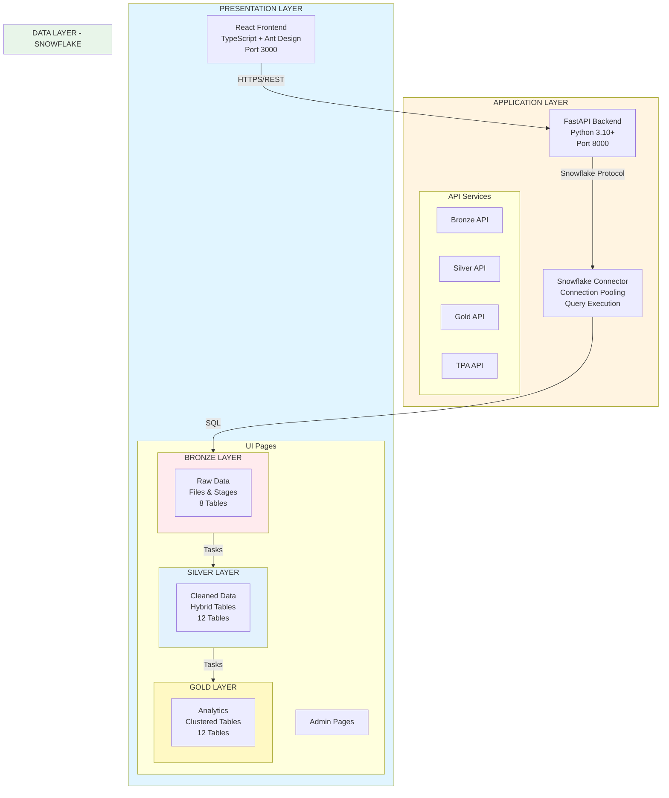

### Architecture Layers

1. **Presentation Layer**
   - React-based SPA with TypeScript
   - Ant Design component library
   - Responsive, modern UI
   - Real-time status updates

2. **Application Layer**
   - FastAPI RESTful backend
   - Async request handling
   - Connection pooling
   - Business logic orchestration

3. **Data Layer**
   - Snowflake database
   - Medallion architecture
   - Hybrid and clustered tables
   - Automated task orchestration

---

## Component Architecture

### Frontend Architecture

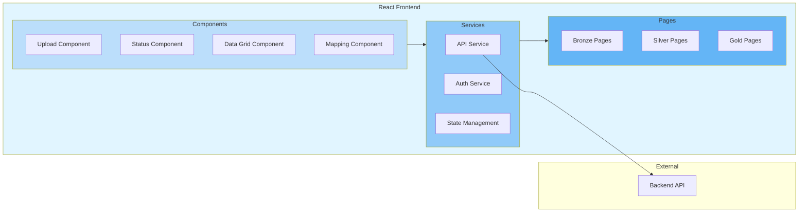

### Backend Architecture

```mermaid
graph TB
    subgraph Backend["FastAPI Backend"]
        subgraph Routes["API Routes"]
            BronzeRoute[/api/bronze/*]
            SilverRoute[/api/silver/*]
            GoldRoute[/api/gold/*]
            TPARoute[/api/tpa/*]
        end
        
        subgraph Services["Business Services"]
            FileService[File Service]
            TransformService[Transform Service]
            MappingService[Mapping Service]
            TPAService[TPA Service]
        end
        
        subgraph Data["Data Access"]
            SnowRepo[Snowflake Repository]
            ConnPool[Connection Pool]
        end
        
        subgraph AI["AI Services"]
            MLService[ML Mapping Service]
            LLMService[LLM Service<br/>Cortex AI]
        end
    end
    
    Routes --> Services
    Services --> Data
    Services --> AI
    Data --> ConnPool
    
    style Backend fill:#fff4e1
    style Routes fill:#ffe0b2
    style Services fill:#ffcc80
    style Data fill:#ffb74d
    style AI fill:#ff9800
```

### Database Architecture

```mermaid
graph TB
    subgraph Database["SNOWFLAKE DATABASE"]
        subgraph Bronze["BRONZE LAYER"]
            BronzeStages[Stages<br/>@SRC, @COMPLETED<br/>@ERROR, @ARCHIVE]
            BronzeTables[Tables<br/>raw_claims_data<br/>file_processing_log<br/>tpa_config]
            BronzeProcs[Procedures<br/>register_tpa<br/>upload_file<br/>process_file]
            BronzeTasks[Tasks<br/>Auto-process<br/>Cleanup]
        end
        
        subgraph Silver["SILVER LAYER"]
            SilverHybrid[Hybrid Tables<br/>target_schemas<br/>field_mappings<br/>transformation_rules<br/>+ 8 indexes]
            SilverStandard[Standard Tables<br/>processing_log<br/>quality_metrics<br/>quarantine]
            SilverProcs[Procedures<br/>create_table<br/>map_fields<br/>transform<br/>suggest_ml<br/>suggest_llm]
            SilverTasks[Tasks<br/>Auto-transform<br/>Quality checks]
        end
        
        subgraph Gold["GOLD LAYER"]
            GoldHybrid[Hybrid Tables<br/>target_schemas<br/>transformation_rules<br/>quality_rules<br/>+ 14 indexes]
            GoldClustered[Clustered Tables<br/>CLAIMS_ANALYTICS<br/>MEMBER_360<br/>PROVIDER_PERF<br/>FINANCIAL_SUMMARY]
            GoldRules[Metadata<br/>11 Transform Rules<br/>5 Quality Rules<br/>5 Business Metrics]
        end
    end
    
    Bronze -->|Automated Tasks| Silver
    Silver -->|Automated Tasks| Gold
    
    style Database fill:#e8f5e9
    style Bronze fill:#ffcdd2
    style Silver fill:#bbdefb
    style Gold fill:#fff9c4
```

---

## Data Layer Architecture

### Table Types and Optimization

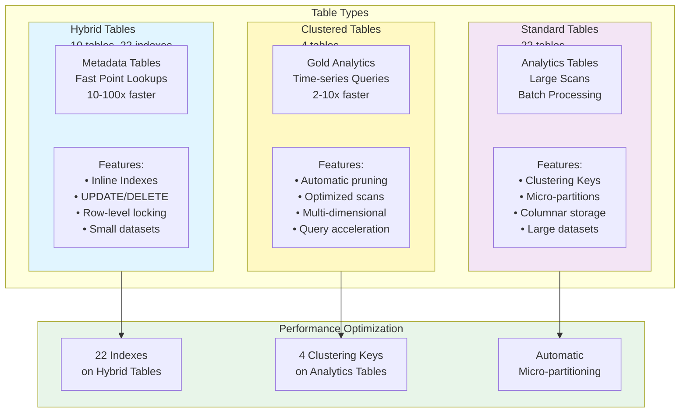

### Index Strategy

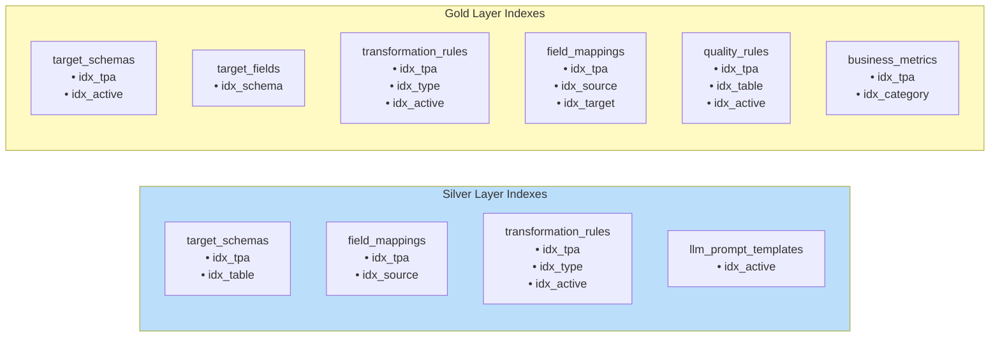

### Clustering Strategy

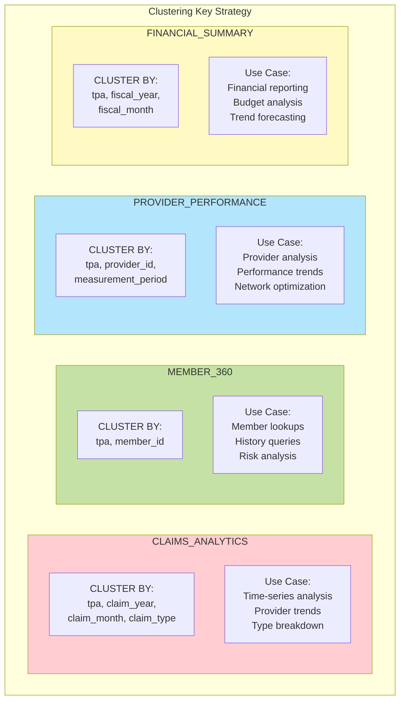

---

## Deployment Architecture

### Local Development

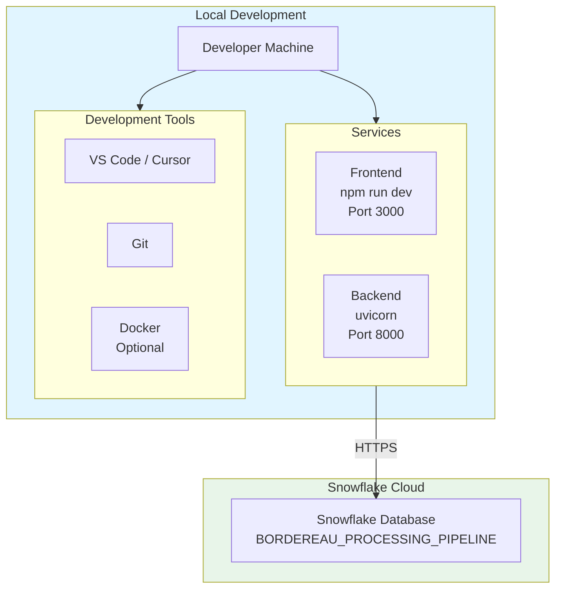

### Docker Deployment

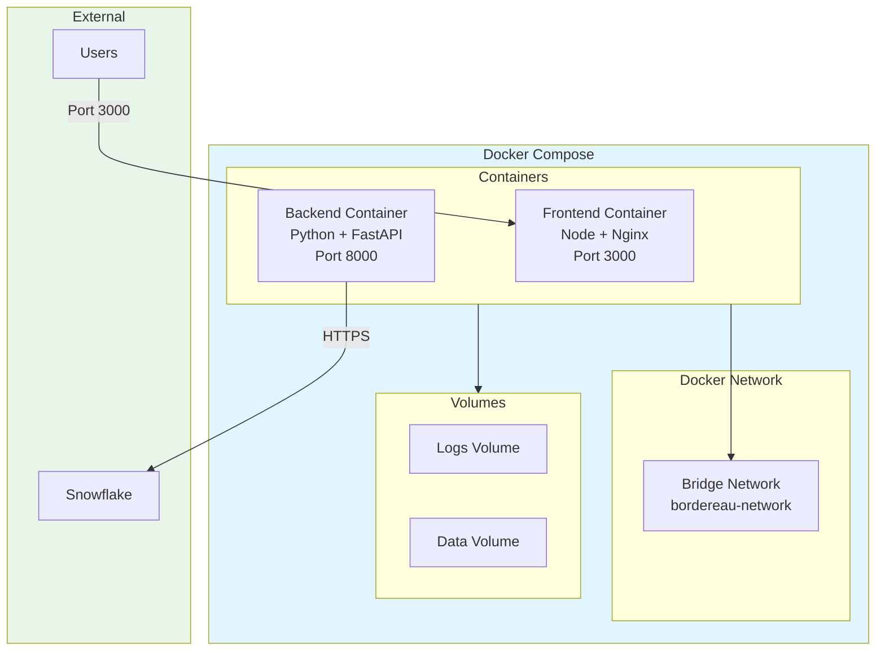

### Snowpark Container Services (SPCS) - Current Deployment

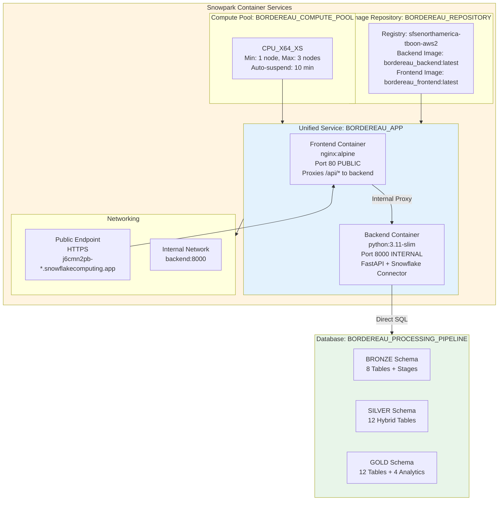

**Key Features**:
- ✅ **Unified Service**: Single service with both frontend and backend
- ✅ **Secure**: Backend is internal-only, not publicly accessible
- ✅ **Efficient**: Frontend proxies API calls to backend
- ✅ **Scalable**: Min 1, Max 3 instances with auto-scaling
- ✅ **Cost-Effective**: Auto-suspend after 10 minutes of inactivity

---

## Security Architecture

### Authentication & Authorization

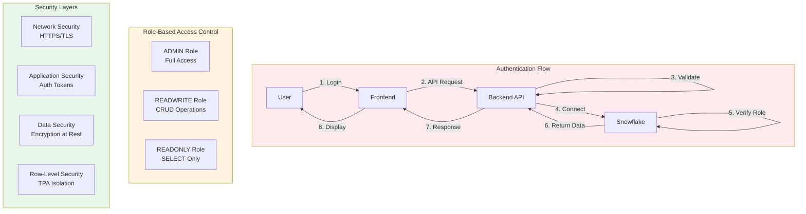

### Multi-Tenancy Architecture

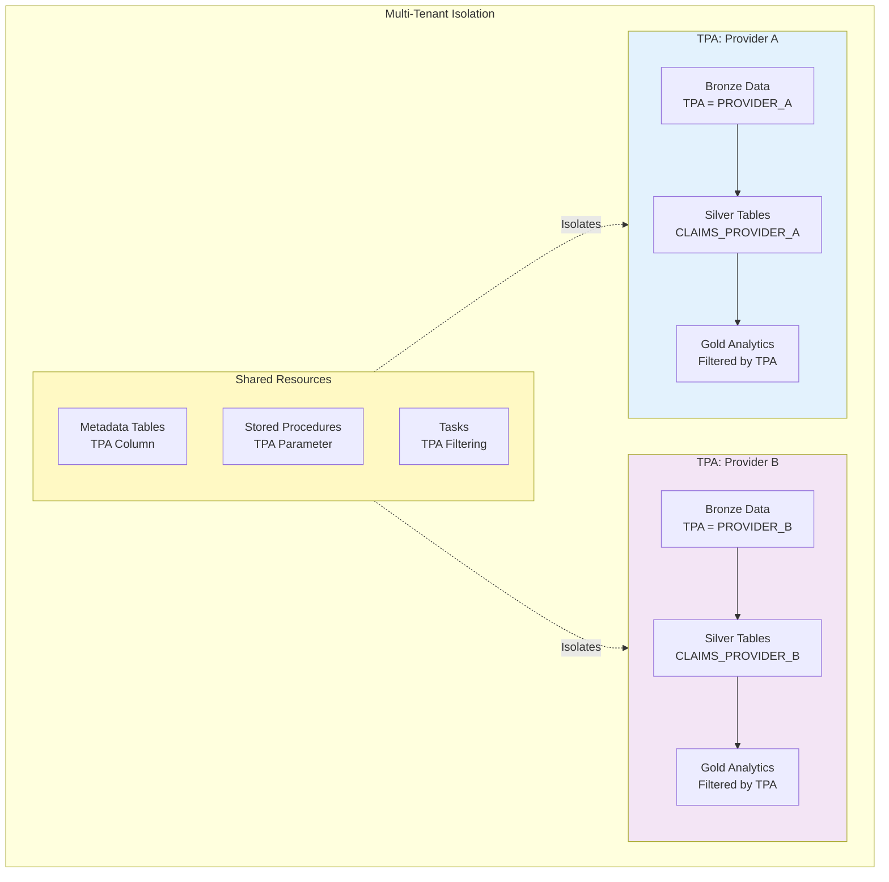

---

## Integration Architecture

### External Integrations

```mermaid
graph LR
    subgraph External["External Systems"]
        SFTP[SFTP/FTP Servers]
        S3[AWS S3]
        Azure[Azure Blob]
        GCS[Google Cloud Storage]
        API_Ext[External APIs]
    end
    
    subgraph Pipeline["Bordereau Pipeline"]
        Ingestion[Data Ingestion]
        Processing[Processing Engine]
        Export[Data Export]
    end
    
    subgraph Downstream["Downstream Systems"]
        BI[BI Tools<br/>Tableau, PowerBI]
        DW[Data Warehouse]
        ML[ML Platforms]
    end
    
    External -->|Pull/Push| Ingestion
    Ingestion --> Processing
    Processing --> Export
    Export --> Downstream
    
    style External fill:#e1f5ff
    style Pipeline fill:#fff4e1
    style Downstream fill:#e8f5e9
```

### API Integration

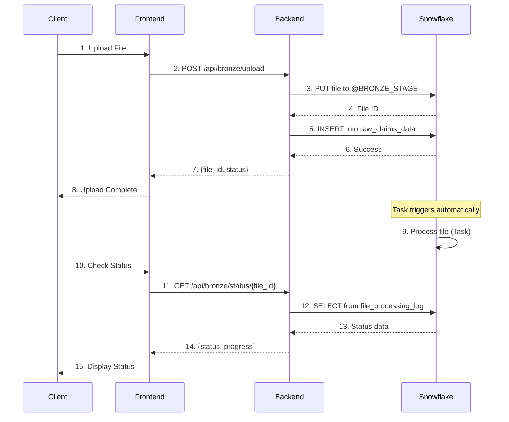

---

## Performance Architecture

### Query Optimization

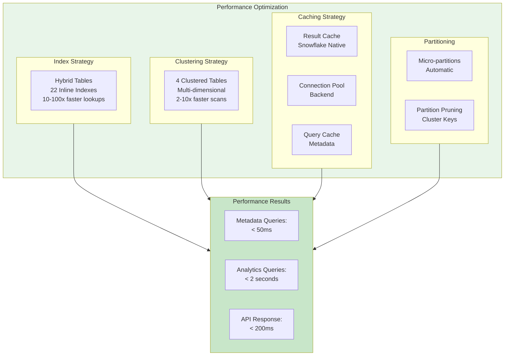

### Scalability Architecture

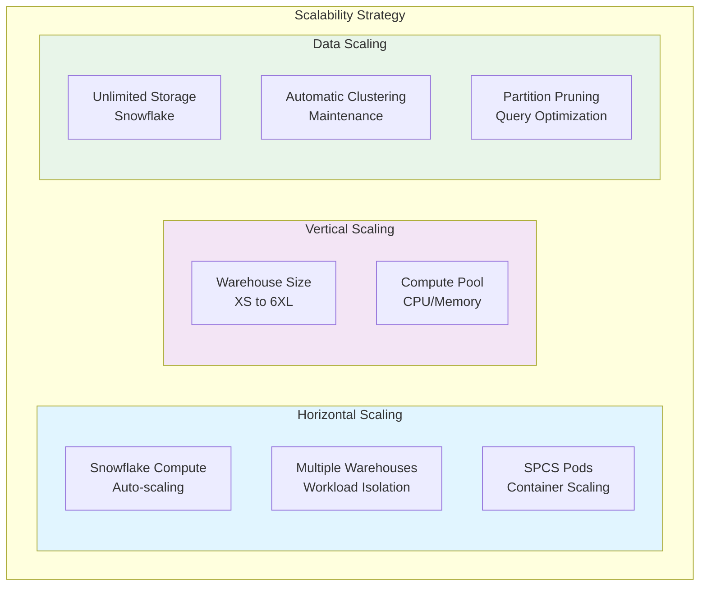

---

## Technology Stack

### Complete Technology Stack

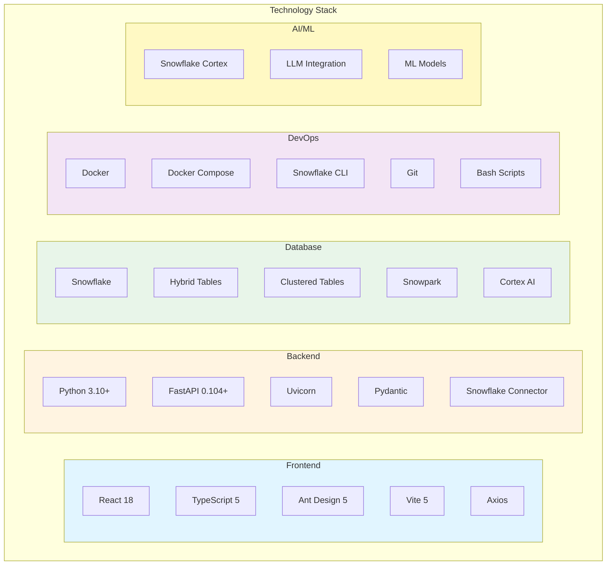

---

## Diagram Rendering

### How to View These Diagrams

1. **GitHub**: Mermaid diagrams render automatically in GitHub markdown
2. **VS Code**: Install "Markdown Preview Mermaid Support" extension
3. **Cursor**: Mermaid diagrams render in preview mode
4. **Export as Images**: Use [Mermaid Live Editor](https://mermaid.live/) to export as PNG/SVG
5. **Documentation Sites**: Most modern documentation platforms support Mermaid

### Export to Images

To export diagrams as images:

```bash
# Using Mermaid CLI
npm install -g @mermaid-js/mermaid-cli
mmdc -i docs/SYSTEM_ARCHITECTURE_MERMAID.md -o docs/images/architecture.png

# Or use Mermaid Live Editor
# 1. Copy diagram code
# 2. Paste into https://mermaid.live/
# 3. Click "Download PNG" or "Download SVG"
```

---

## Summary

This architecture documentation provides a comprehensive view of the Bordereau Processing Pipeline using professional Mermaid diagrams that can be:

- ✅ Rendered in GitHub/GitLab
- ✅ Viewed in modern IDEs
- ✅ Exported as high-quality images
- ✅ Embedded in documentation sites
- ✅ Easily maintained and updated

The diagrams cover all aspects of the system:
- High-level architecture
- Component architecture
- Data layer design
- Deployment options
- Security model
- Integration patterns
- Performance optimization
- Technology stack

**Next**: See [DATA_FLOW_MERMAID.md](DATA_FLOW_MERMAID.md) for detailed data flow diagrams.
