# Data Flow Documentation

**Bordereau Processing Pipeline**  
**Version**: 2.0  
**Date**: January 19, 2026

---

## Table of Contents

1. [Overview](#overview)
2. [End-to-End Data Flow](#end-to-end-data-flow)
3. [Bronze Layer Data Flow](#bronze-layer-data-flow)
4. [Silver Layer Data Flow](#silver-layer-data-flow)
5. [Gold Layer Data Flow](#gold-layer-data-flow)
6. [Task Orchestration Flow](#task-orchestration-flow)
7. [Error Handling Flow](#error-handling-flow)
8. [Data Quality Flow](#data-quality-flow)

---

## Overview

The Bordereau Processing Pipeline implements a **medallion architecture** with three distinct layers, each serving a specific purpose in the data transformation journey from raw files to analytics-ready datasets.

### Data Flow Principles

1. **Unidirectional**: Data flows Bronze → Silver → Gold
2. **Immutable Bronze**: Raw data never modified
3. **Versioned**: All transformations tracked
4. **Auditable**: Complete lineage maintained
5. **Recoverable**: Failed records quarantined, not lost

---

## End-to-End Data Flow

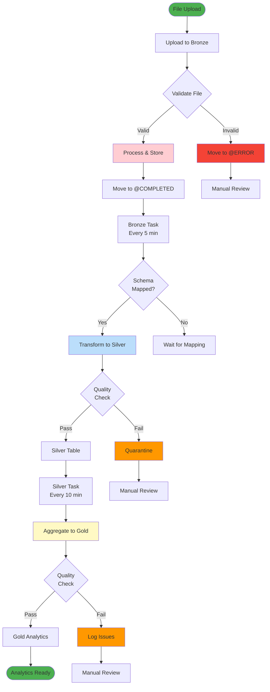

---

## Bronze Layer Data Flow

### File Upload and Processing

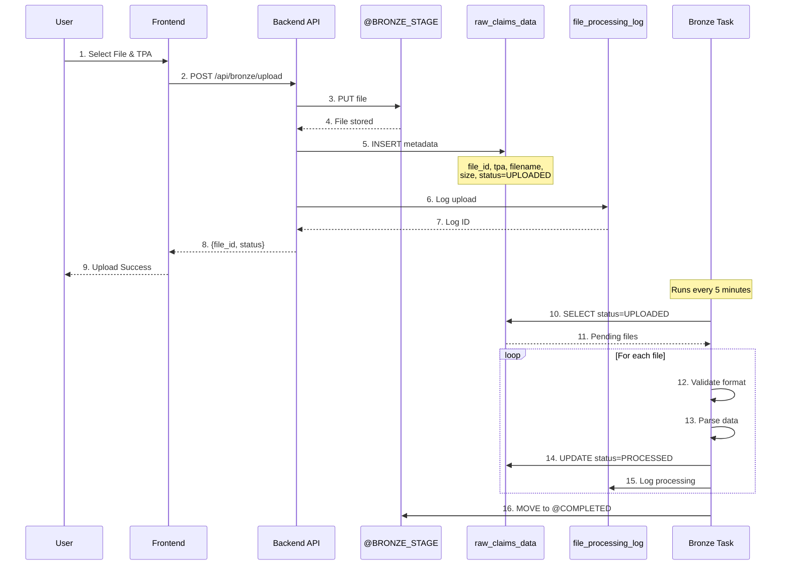

### Bronze Processing States

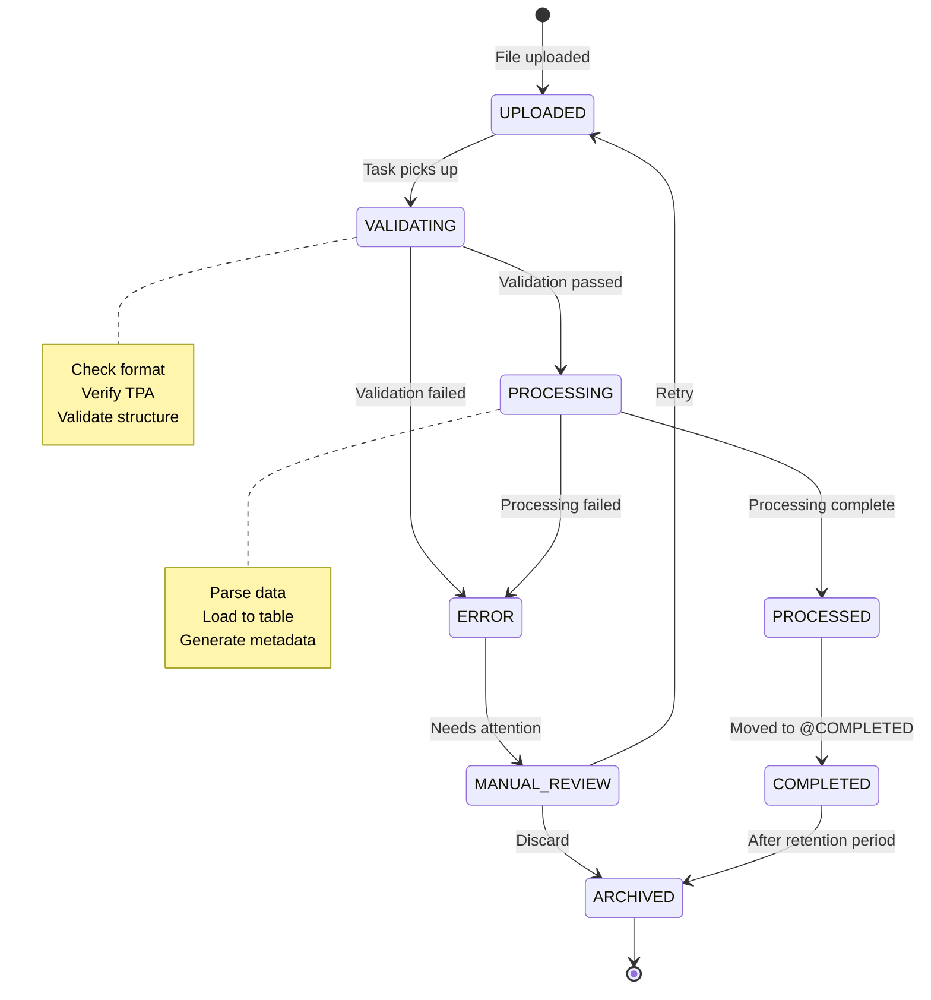

### Bronze Data Storage

```mermaid
graph TB
    subgraph Upload["File Upload"]
        File[CSV/Excel File]
        Metadata[File Metadata<br/>TPA, Size, Format]
    end
    
    subgraph Stages["Bronze Stages"]
        SRC[@SRC<br/>Source Files]
        COMPLETED[@COMPLETED<br/>Processed Files]
        ERROR[@ERROR<br/>Failed Files]
        ARCHIVE[@ARCHIVE<br/>Old Files]
    end
    
    subgraph Tables["Bronze Tables"]
        Raw[raw_claims_data<br/>Immutable Raw Data]
        Queue[file_processing_queue<br/>Processing Queue]
        Log[file_processing_log<br/>Audit Trail]
        TPA[tpa_config<br/>TPA Settings]
    end
    
    File --> SRC
    Metadata --> Raw
    SRC -->|Success| COMPLETED
    SRC -->|Failure| ERROR
    COMPLETED -->|30 days| ARCHIVE
    
    Raw --> Queue
    Queue --> Log
    TPA -.->|Config| Queue
    
    style Upload fill:#e1f5ff
    style Stages fill:#ffebee
    style Tables fill:#ffcdd2
```

---

## Silver Layer Data Flow

### Schema Mapping and Transformation

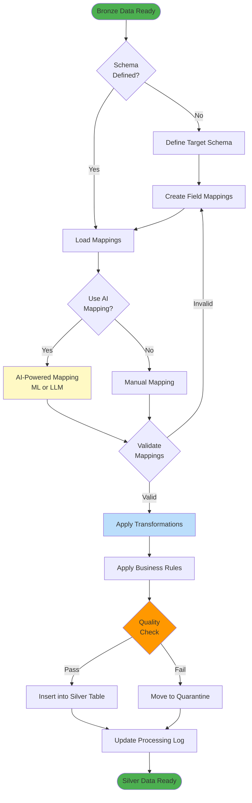

### Silver Transformation Process

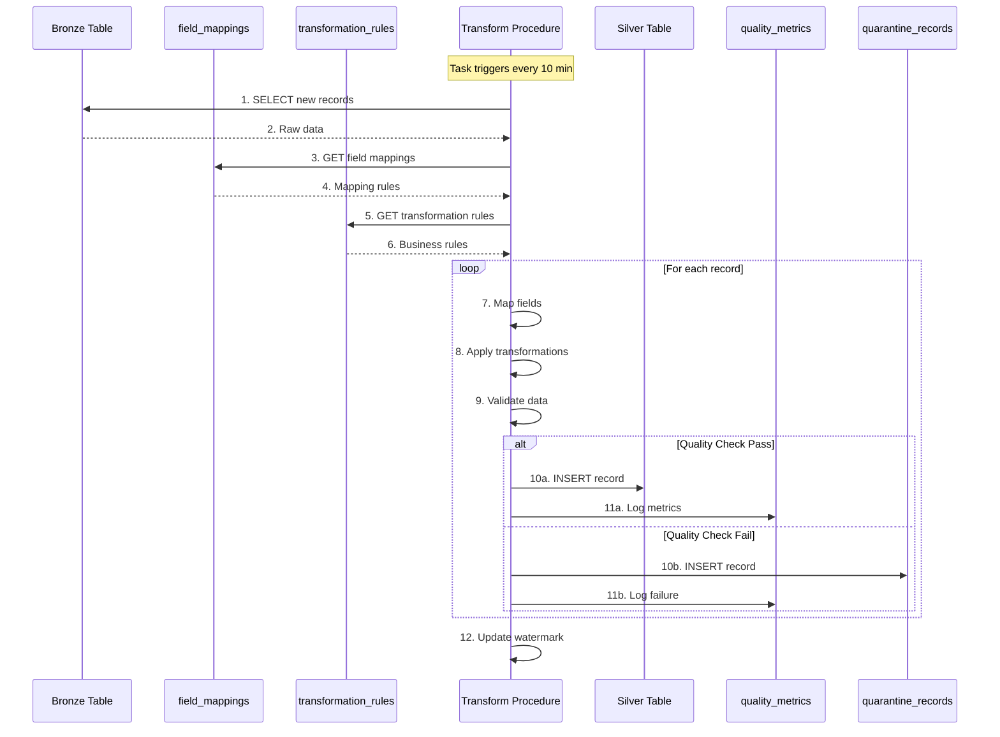

### AI-Powered Mapping

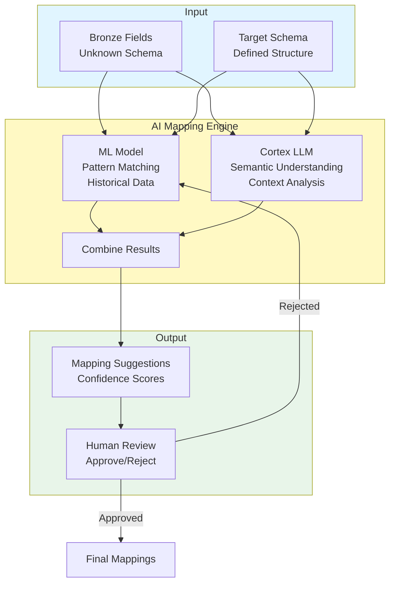

### Silver Data Quality

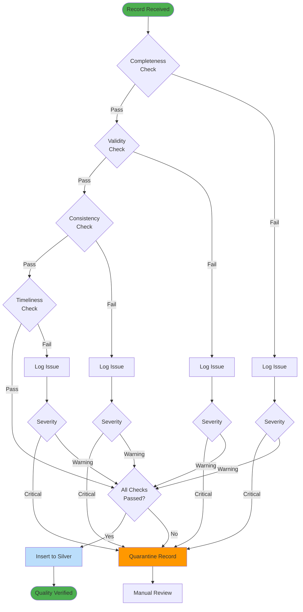

---

## Gold Layer Data Flow

### Analytics Aggregation

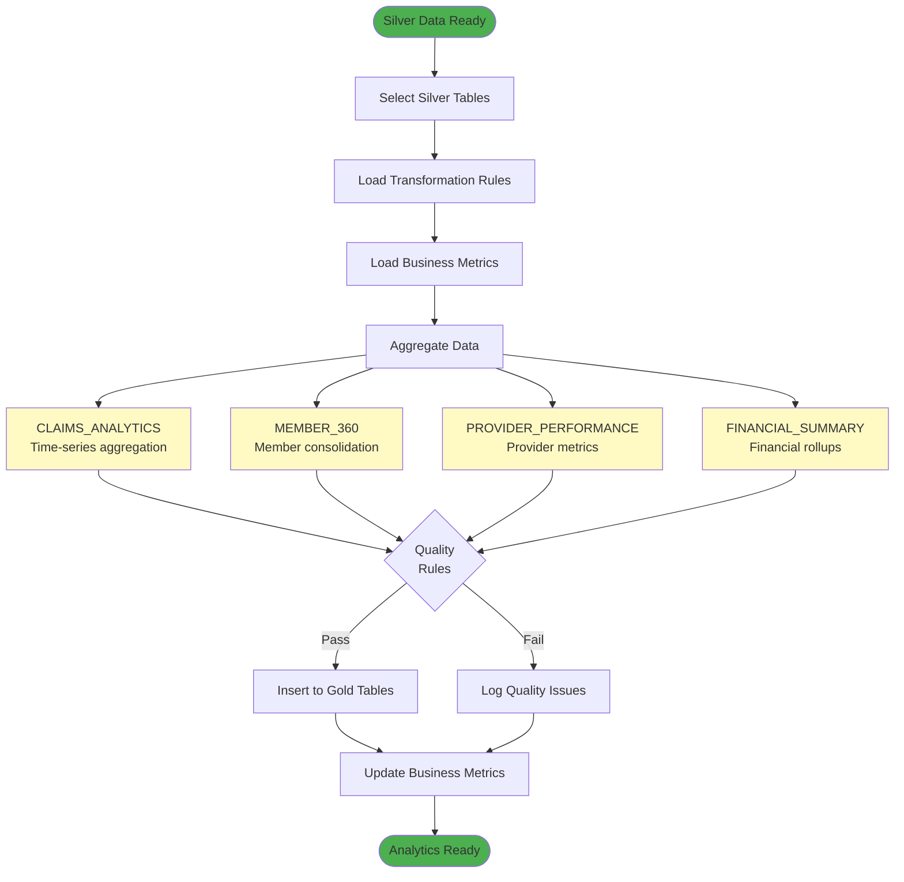

### Gold Transformation Flow

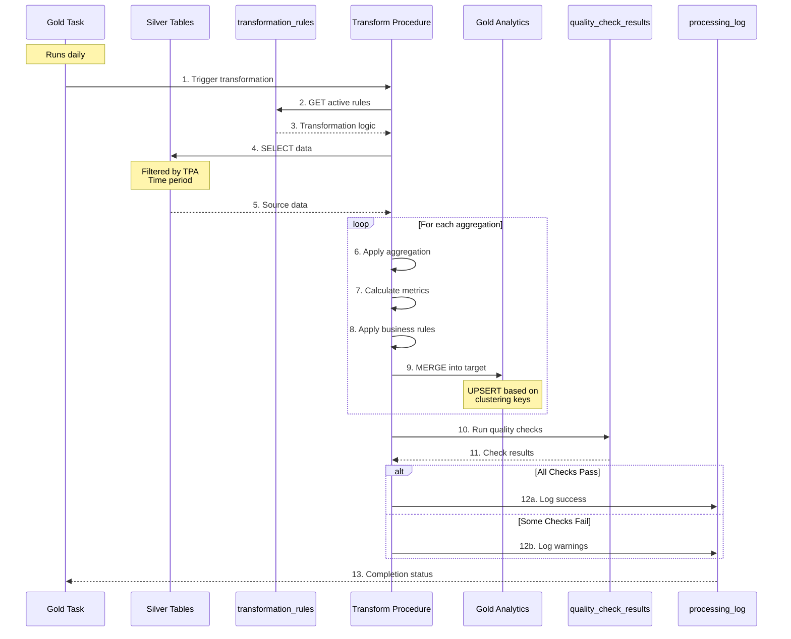

### Gold Analytics Tables

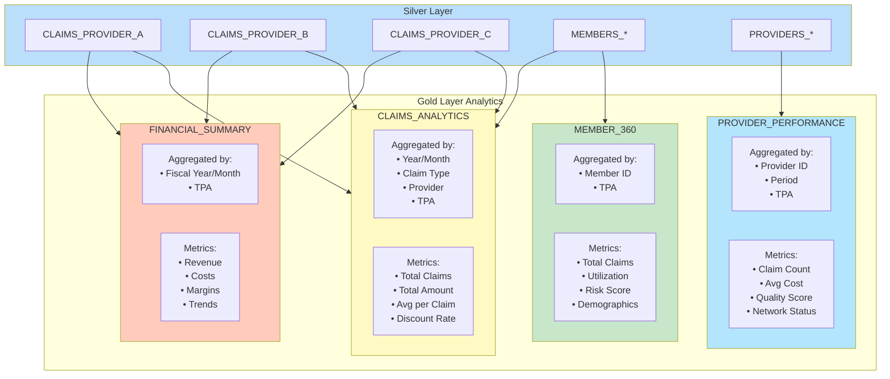

---

## Task Orchestration Flow

### Task Dependencies and Schedule

```mermaid
gantt
    title Task Orchestration Timeline
    dateFormat HH:mm
    axisFormat %H:%M
    
    section Bronze Layer
    File Discovery       :done, bronze1, 00:00, 5m
    File Processing      :done, bronze2, after bronze1, 10m
    File Cleanup         :done, bronze3, after bronze2, 5m
    
    section Silver Layer
    Wait for Bronze      :crit, silver1, after bronze3, 5m
    Schema Mapping       :active, silver2, after silver1, 15m
    Transformation       :silver3, after silver2, 20m
    Quality Checks       :silver4, after silver3, 10m
    
    section Gold Layer
    Wait for Silver      :crit, gold1, after silver4, 10m
    Aggregation          :gold2, after gold1, 30m
    Quality Checks       :gold3, after gold2, 10m
    Metric Calculation   :gold4, after gold3, 5m
```

### Task Execution Flow

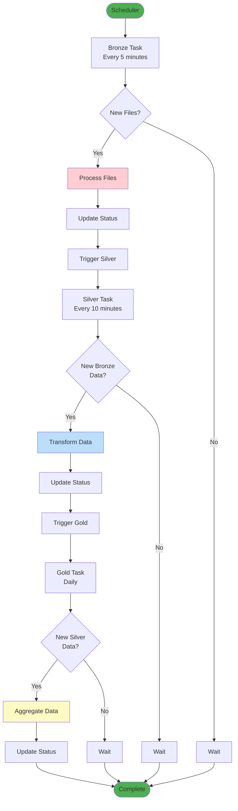

### Task Monitoring

```mermaid
graph TB
    subgraph Monitoring["Task Monitoring"]
        subgraph Status["Task Status"]
            Running[Running Tasks]
            Completed[Completed Tasks]
            Failed[Failed Tasks]
            Suspended[Suspended Tasks]
        end
        
        subgraph Metrics["Metrics"]
            Duration[Execution Duration]
            Records[Records Processed]
            Errors[Error Count]
            Success[Success Rate]
        end
        
        subgraph Logs["Logging"]
            ProcessLog[processing_log]
            TaskHistory[task_history]
            ErrorLog[error_log]
        end
        
        subgraph Views["Monitoring Views"]
            V1[v_bronze_status]
            V2[v_silver_status]
            V3[v_gold_status]
            V4[v_task_summary]
        end
    end
    
    Status --> Metrics
    Metrics --> Logs
    Logs --> Views
    
    style Status fill:#e1f5ff
    style Metrics fill:#fff9c4
    style Logs fill:#ffebee
    style Views fill:#e8f5e9
```

---

## Error Handling Flow

### Error Processing

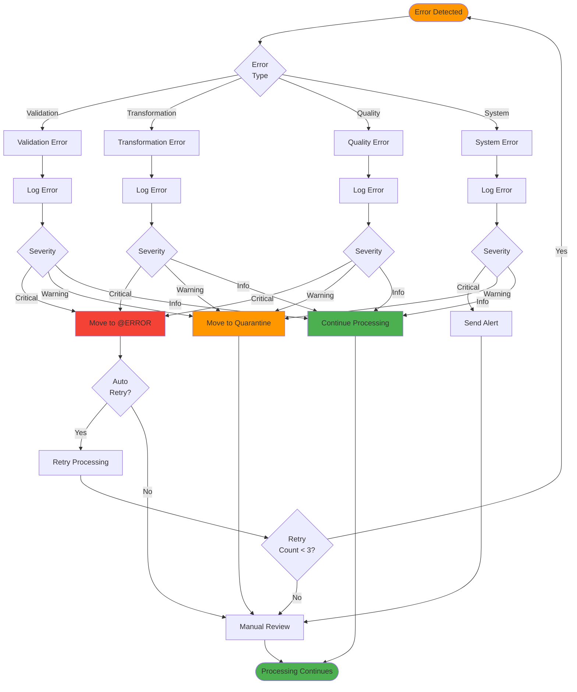

### Error Recovery

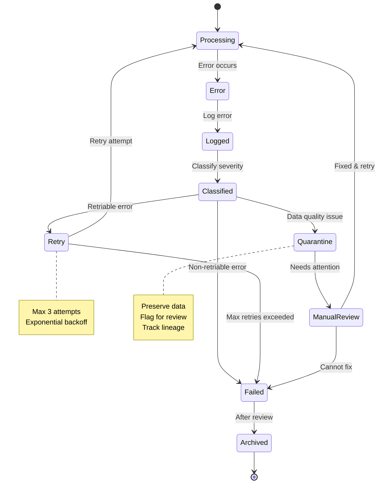

---

## Data Quality Flow

### Quality Check Framework

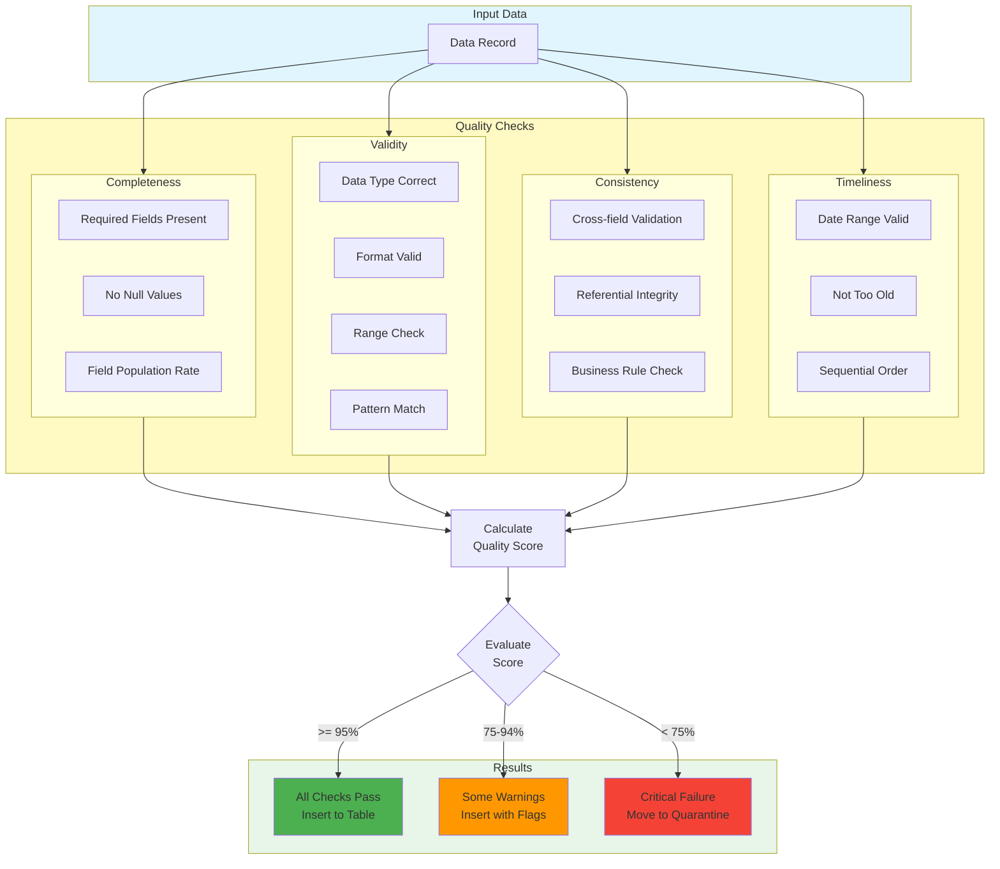

### Quality Metrics Tracking

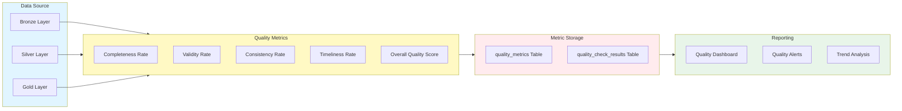

---

## Summary

This data flow documentation provides comprehensive Mermaid diagrams covering:

- ✅ End-to-end data flow across all layers
- ✅ Detailed Bronze, Silver, and Gold processing
- ✅ Task orchestration and scheduling
- ✅ Error handling and recovery
- ✅ Data quality framework
- ✅ AI-powered mapping flows
- ✅ State transitions and sequences

All diagrams are:
- Professional and publication-ready
- Renderable in GitHub/GitLab
- Exportable as high-quality images
- Easy to maintain and update

**Next**: See [SYSTEM_DESIGN_MERMAID.md](SYSTEM_DESIGN_MERMAID.md) for design patterns and decisions.
