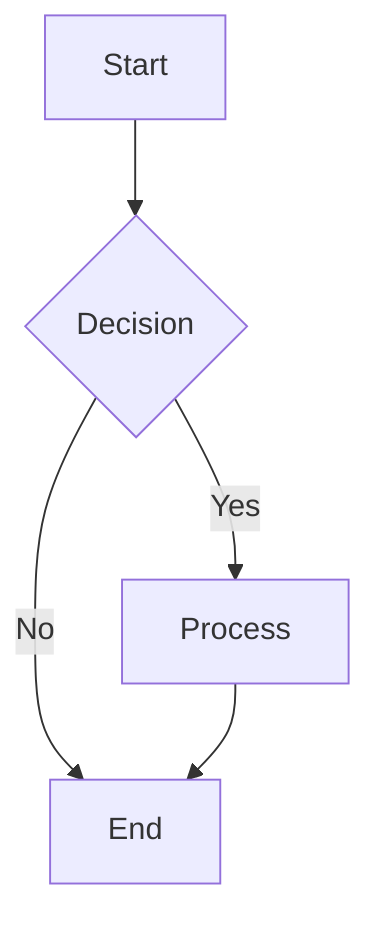
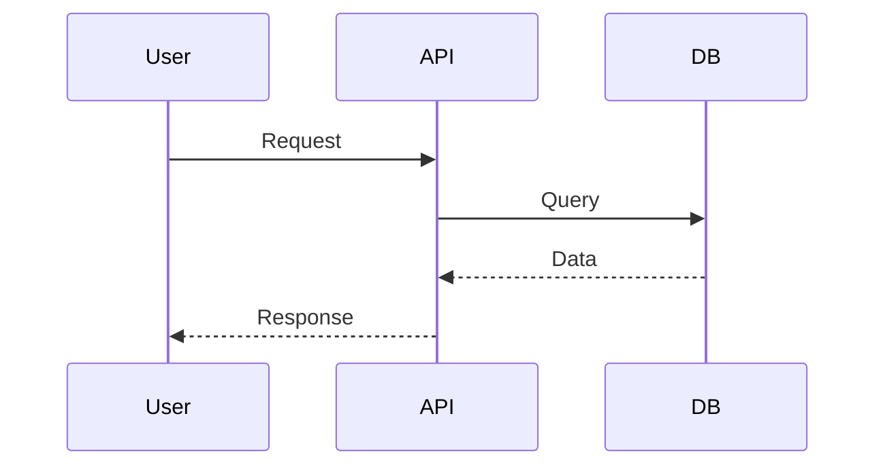
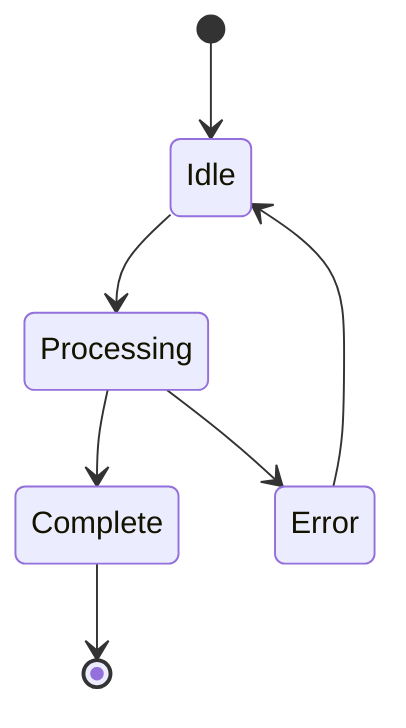
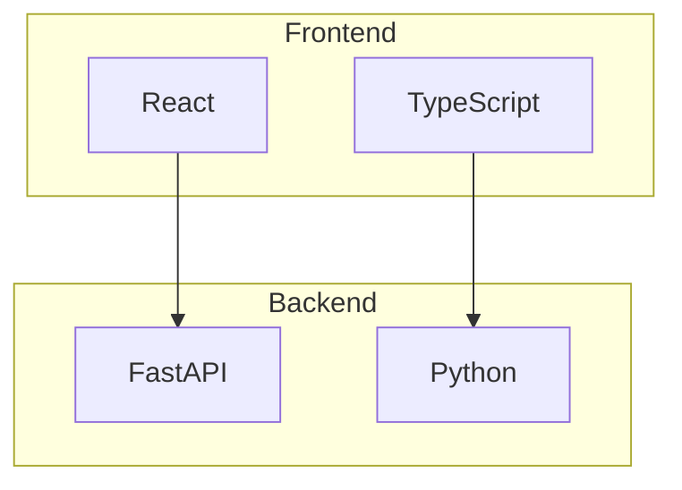
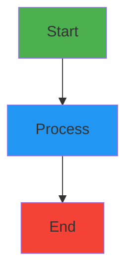
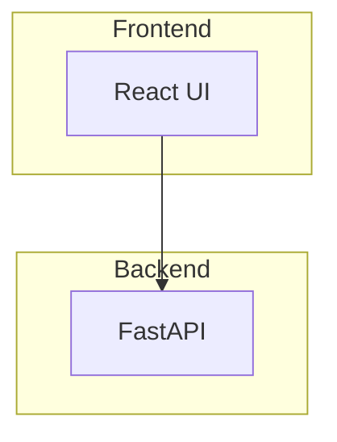
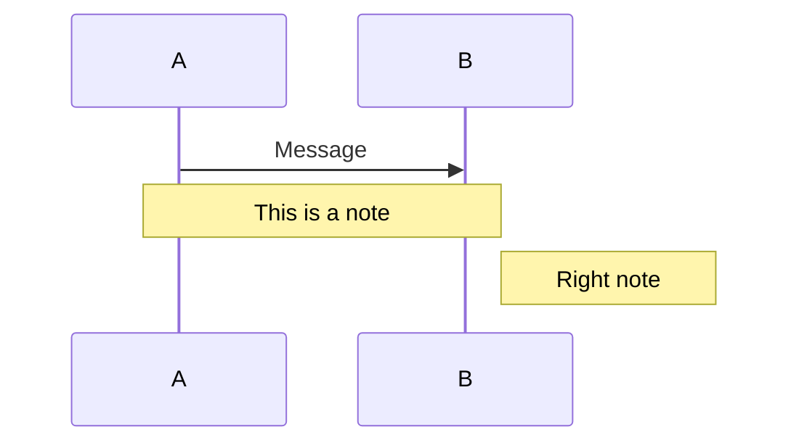

# Mermaid Diagrams Guide

**Bordereau Processing Pipeline**  
**Date**: January 19, 2026

---

## Overview

This project now includes professional Mermaid diagrams for all architecture and data flow documentation. Mermaid is a text-based diagramming tool that creates beautiful, professional diagrams that can be rendered in GitHub, documentation sites, and exported as images.

---

## Available Documentation

### Architecture Documentation

**File**: `docs/SYSTEM_ARCHITECTURE_MERMAID.md`

**Diagrams Include**:
- High-level system architecture
- Frontend component architecture
- Backend service architecture
- Database architecture
- Table types and optimization strategies
- Index and clustering strategies
- Deployment architectures (Local, Docker, SPCS)
- Security and multi-tenancy architecture
- Integration patterns
- Performance optimization
- Technology stack

### Data Flow Documentation

**File**: `docs/DATA_FLOW_MERMAID.md`

**Diagrams Include**:
- End-to-end data flow
- Bronze layer processing flow
- Silver layer transformation flow
- Gold layer aggregation flow
- Task orchestration timeline
- Error handling and recovery
- Data quality framework
- AI-powered mapping flows
- State transitions
- Sequence diagrams

---

## Viewing Mermaid Diagrams

### 1. GitHub/GitLab (Automatic)

Simply push your files to GitHub or GitLab, and the Mermaid diagrams will render automatically!

```bash
git add docs/SYSTEM_ARCHITECTURE_MERMAID.md docs/DATA_FLOW_MERMAID.md
git commit -m "Add professional Mermaid diagrams"
git push
```

Then view on GitHub - diagrams render beautifully!

### 2. Cursor IDE (Built-in Support)

Cursor has built-in Mermaid support:

1. Open any `*_MERMAID.md` file
2. Click the preview button (or press `Cmd+Shift+V` on Mac, `Ctrl+Shift+V` on Windows)
3. Diagrams render automatically in the preview pane

### 3. VS Code

Install the Mermaid extension:

```bash
# Install extension
code --install-extension bierner.markdown-mermaid
```

Then:
1. Open any `*_MERMAID.md` file
2. Press `Cmd+Shift+V` (Mac) or `Ctrl+Shift+V` (Windows)
3. Diagrams render in the preview

### 4. Online Viewers

**Mermaid Live Editor**: https://mermaid.live/

1. Copy any Mermaid diagram code (between ` ```mermaid` and ` ``` `)
2. Paste into https://mermaid.live/
3. View and edit interactively
4. Download as PNG, SVG, or share link

---

## Exporting Diagrams as Images

### Method 1: Mermaid CLI (Recommended for Batch)

Install the Mermaid CLI:

```bash
npm install -g @mermaid-js/mermaid-cli
```

Export entire document:

```bash
# Export all diagrams from a file
mmdc -i docs/SYSTEM_ARCHITECTURE_MERMAID.md -o docs/images/architecture.png

# Export with custom theme
mmdc -i docs/DATA_FLOW_MERMAID.md -o docs/images/dataflow.png -t forest

# Export as SVG (scalable)
mmdc -i docs/SYSTEM_ARCHITECTURE_MERMAID.md -o docs/images/architecture.svg

# Export with custom width
mmdc -i docs/DATA_FLOW_MERMAID.md -o docs/images/dataflow.png -w 2000
```

Available themes:
- `default` - Clean, professional
- `forest` - Green tones
- `dark` - Dark mode
- `neutral` - Grayscale

### Method 2: Mermaid Live Editor (Recommended for Individual Diagrams)

For individual diagrams:

1. **Copy diagram code**:
   ```mermaid
   graph TB
       A[Start] --> B[Process]
       B --> C[End]
   ```

2. **Open Mermaid Live Editor**: https://mermaid.live/

3. **Paste code** into the editor

4. **Download**:
   - Click "Download PNG" for raster image
   - Click "Download SVG" for vector image (scalable)
   - Click "Copy SVG" to paste into other tools

5. **Options**:
   - Adjust theme (top right)
   - Change background color
   - Adjust zoom level

### Method 3: VS Code Extension

Install Markdown PDF extension:

```bash
code --install-extension yzane.markdown-pdf
```

Then:
1. Open `*_MERMAID.md` file
2. Right-click in editor
3. Select "Markdown PDF: Export (png)" or "Markdown PDF: Export (pdf)"
4. Images saved to same directory

### Method 4: Browser Screenshot

1. View diagram in GitHub or Mermaid Live
2. Use browser screenshot tool:
   - **Chrome**: Right-click → "Capture node screenshot"
   - **Firefox**: Screenshot tool (Ctrl+Shift+S)
   - **Safari**: Cmd+Shift+4 (Mac)

---

## Diagram Types Used

### 1. Flowcharts

**Syntax**: `flowchart TD` (top-down) or `flowchart LR` (left-right)

**Example**:


**Used For**: Process flows, decision trees, data flow

### 2. Sequence Diagrams

**Syntax**: `sequenceDiagram`

**Example**:


**Used For**: API interactions, message flows, temporal sequences

### 3. State Diagrams

**Syntax**: `stateDiagram-v2`

**Example**:


**Used For**: State machines, status transitions, lifecycle

### 4. Gantt Charts

**Syntax**: `gantt`

**Example**:


```mermaid
gantt
    title Project Timeline
    dateFormat HH:mm
    section Phase 1
    Task 1 :done, 00:00, 1h
    Task 2 :active, 01:00, 2h
    section Phase 2
    Task 3 :02:00, 1h
```

**Used For**: Timelines, schedules, task dependencies

### 5. Graph Diagrams

**Syntax**: `graph TB` (top-bottom) or `graph LR` (left-right)

**Example**:


**Used For**: Component relationships, system architecture

---

## Customization

### Styling

Add custom styles to diagrams:



### Subgraphs

Group related components:



### Notes and Comments

Add explanatory notes:



---

## Best Practices

### 1. Keep Diagrams Focused

- One concept per diagram
- Limit to 10-15 nodes for readability
- Use subgraphs for organization

### 2. Use Consistent Naming

- Clear, descriptive labels
- Consistent abbreviations
- Meaningful node IDs

### 3. Color Coding

Use colors consistently:
- **Green** (#4caf50): Success, start, completion
- **Blue** (#2196f3): Processing, active states
- **Yellow** (#fff9c4): Warning, attention needed
- **Red** (#f44336): Error, critical, failure
- **Orange** (#ff9800): Quarantine, review needed

### 4. Direction

Choose appropriate direction:
- **Top-Down (TD)**: Hierarchies, process flows
- **Left-Right (LR)**: Timelines, sequences
- **Bottom-Up (BU)**: Dependency trees

### 5. Documentation

- Add title and description
- Include legend if using colors
- Provide context in surrounding text

---

## Integration with Documentation Sites

### GitHub Pages

Mermaid renders automatically in GitHub Pages with Jekyll:

```yaml
# _config.yml
markdown: kramdown
kramdown:
  parse_block_html: true
```

### GitBook

Enable Mermaid plugin:

```json
{
  "plugins": ["mermaid-gb3"]
}
```

### MkDocs

Install Mermaid plugin:

```bash
pip install mkdocs-mermaid2-plugin
```

Add to `mkdocs.yml`:

```yaml
plugins:
  - mermaid2
```

### Docusaurus

Mermaid support built-in (v2.0+):

```js
// docusaurus.config.js
module.exports = {
  markdown: {
    mermaid: true,
  },
  themes: ['@docusaurus/theme-mermaid'],
};
```

---

## Troubleshooting

### Diagram Not Rendering

1. **Check syntax**: Validate at https://mermaid.live/
2. **Check fences**: Ensure ` ```mermaid` and ` ``` ` are correct
3. **Check viewer**: Ensure Mermaid support is enabled
4. **Check version**: Some features require newer Mermaid versions

### Export Issues

1. **CLI not found**: Install with `npm install -g @mermaid-js/mermaid-cli`
2. **Puppeteer issues**: May need to install Chromium
3. **Memory errors**: Reduce diagram complexity or increase Node memory

### Styling Not Applied

1. **Check syntax**: Style commands must be outside subgraphs
2. **Check colors**: Use hex codes (#rrggbb) or named colors
3. **Check theme**: Some themes override custom styles

---

## Examples from This Project

### High-Level Architecture

Location: `docs/SYSTEM_ARCHITECTURE_MERMAID.md` (lines 40-80)

Shows the complete system with Presentation, Application, and Data layers.

### Data Flow

Location: `docs/DATA_FLOW_MERMAID.md` (lines 40-90)

Shows end-to-end data flow from upload to analytics.

### Task Orchestration

Location: `docs/DATA_FLOW_MERMAID.md` (lines 500-550)

Shows task scheduling and dependencies with Gantt chart.

### Error Handling

Location: `docs/DATA_FLOW_MERMAID.md` (lines 600-650)

Shows error classification and recovery flow.

---

## Resources

### Official Documentation

- **Mermaid Docs**: https://mermaid.js.org/
- **Syntax Reference**: https://mermaid.js.org/intro/syntax-reference.html
- **Live Editor**: https://mermaid.live/

### Tools

- **Mermaid CLI**: https://github.com/mermaid-js/mermaid-cli
- **VS Code Extension**: https://marketplace.visualstudio.com/items?itemName=bierner.markdown-mermaid
- **Chrome Extension**: https://chrome.google.com/webstore (search "Mermaid")

### Tutorials

- **Official Tutorial**: https://mermaid.js.org/intro/getting-started.html
- **Video Tutorials**: YouTube "Mermaid Diagrams"
- **Examples**: https://mermaid.js.org/syntax/examples.html

---

## Migration from ASCII

If you prefer Mermaid diagrams over ASCII:

1. **Keep both versions** (recommended):
   - Original: `SYSTEM_ARCHITECTURE.md`
   - Mermaid: `SYSTEM_ARCHITECTURE_MERMAID.md`

2. **Replace originals**:
   ```bash
   mv docs/SYSTEM_ARCHITECTURE.md docs/SYSTEM_ARCHITECTURE_ASCII.md
   mv docs/SYSTEM_ARCHITECTURE_MERMAID.md docs/SYSTEM_ARCHITECTURE.md
   ```

3. **Update links** in README and other docs

---

## Summary

✅ **Professional Diagrams**: Publication-quality visuals  
✅ **Easy to Maintain**: Text-based, version control friendly  
✅ **Auto-Rendering**: GitHub, GitLab, modern IDEs  
✅ **Exportable**: PNG, SVG, PDF formats  
✅ **Interactive**: Some renderers support zoom/pan  
✅ **Consistent**: Uniform styling across all diagrams  

**Start using**: Open `docs/SYSTEM_ARCHITECTURE_MERMAID.md` or `docs/DATA_FLOW_MERMAID.md` in Cursor to see the diagrams!

---

**Created**: January 19, 2026  
**Version**: 1.0
