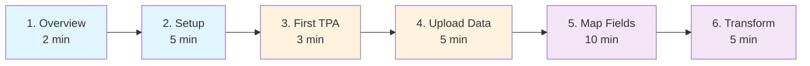

# 📚 Bordereau Documentation

> Complete documentation for the Bordereau Processing Pipeline

[]()
[]()
[]()

**Last Updated**: February 3, 2026

---

## 🗺️ Documentation Map

```
📚 Documentation
│
├── 📖 README.md (You are here)
│   └── Central navigation hub
│
├── 🚀 ../README.md
│   └── Quick start & overview
│
├── 🎓 GUIDE.md (50+ pages)
│   ├── Getting Started
│   ├── TPA Management
│   ├── Bronze Layer (Data Ingestion)
│   ├── Silver Layer (Transformation)
│   ├── Gold Layer (Analytics)
│   ├── Technical Reference
│   ├── Troubleshooting
│   ├── FAQ
│   └── Glossary
│
├── 🏗️ ARCHITECTURE.md
│   ├── System Architecture Diagram
│   ├── Entity Reference
│   ├── Data Flow
│   └── Design Principles
│
├── 📝 CHANGELOG.md
│   └── Documentation version history
│
└── 📊 OPTIMIZATION_SUMMARY.md
    └── Documentation improvements log
```

---

## 📖 Documentation Structure

| Document | Purpose | Pages | Audience | Reading Time |
|----------|---------|-------|----------|--------------|
| **[🚀 Quick Start](../README.md)** | Get started in 5 minutes | 1 | Everyone | 2 min |
| **[🎓 User Guide](GUIDE.md)** | Complete usage instructions | 50+ | End users, admins | 35 min |
| **[🏗️ Architecture](ARCHITECTURE.md)** | Technical design & data model | 10 | Developers, architects | 15 min |
| **[📝 Changelog](CHANGELOG.md)** | Documentation history | 5 | Maintainers | 5 min |
| **[📊 Optimization](OPTIMIZATION_SUMMARY.md)** | Improvement summary | 10 | Maintainers | 10 min |

---

## 🚀 Getting Started

**New to Bordereau?** Follow this learning path:

### 🎯 Learning Path (30 minutes)



| Step | Document | Section | Time |
|------|----------|---------|------|
| **1** | [README](../README.md) | Overview & Quick Start | 2 min |
| **2** | [User Guide](GUIDE.md#getting-started) | Prerequisites & Setup | 5 min |
| **3** | [User Guide](GUIDE.md#tpa-management) | Create First TPA | 3 min |
| **4** | [User Guide](GUIDE.md#bronze-layer---data-ingestion) | Upload Files | 5 min |
| **5** | [User Guide](GUIDE.md#silver-layer---transformation) | Map Fields (ML/LLM) | 10 min |
| **6** | [User Guide](GUIDE.md#3-execute-transformation) | Transform Data | 5 min |

**Total**: ~30 minutes from zero to analytics

---

## 📚 User Guide Sections

### [Getting Started](GUIDE.md#getting-started)
- Prerequisites and installation
- First-time setup
- 5-minute quick start workflow

### [TPA Management](GUIDE.md#tpa-management)
- What is a TPA?
- Adding new TPAs
- TPA naming conventions
- Multi-tenancy and isolation

### [Bronze Layer - Data Ingestion](GUIDE.md#bronze-layer---data-ingestion)
1. Upload files (CSV/Excel)
2. View raw data
3. Monitor processing status
4. Manage file stages
5. Automated tasks

### [Silver Layer - Transformation](GUIDE.md#silver-layer---transformation)
1. Define target schemas
2. Map fields (Manual/ML/LLM)
3. Execute transformations
4. View transformed data

### [Gold Layer - Analytics](GUIDE.md#gold-layer---analytics)
1. Analytics dashboard
2. Quality metrics
3. Transformation rules

### [Technical Reference](GUIDE.md#technical-reference)
- Technology stack
- Table types and performance
- Task automation
- Security model
- Monitoring and logging
- Deployment options
- Best practices

### [Troubleshooting](GUIDE.md#troubleshooting)
- File not processing
- Transformation failed
- Mapping errors
- Performance issues
- Connection issues
- Common error messages

---

## 🏗️ Architecture Documentation

### [Architecture Overview](ARCHITECTURE.md)
- System architecture diagram (Mermaid)
- Entity relationships
- Data flow visualization

### [Entity Reference](ARCHITECTURE.md#entity-reference)
- Core entities (TPA, User, File)
- Bronze layer entities
- Silver layer entities
- Gold layer entities

### [Data Flow](ARCHITECTURE.md#data-flow)
- End-to-end processing pipeline
- State transitions
- Task orchestration

### [Design Principles](ARCHITECTURE.md#key-design-principles)
- TPA isolation
- Schema reusability
- Mapping flexibility
- Data quality
- Audit trail

---

## 🎯 Common Tasks

### Upload and Process Files
1. [Add TPA](GUIDE.md#add-new-tpa)
2. [Upload Files](GUIDE.md#1-upload-files)
3. [Monitor Processing](GUIDE.md#3-monitor-processing)

### Map and Transform Data
1. [Define Schema](GUIDE.md#1-define-target-schemas)
2. [Auto-Map with ML](GUIDE.md#method-1-auto-map-with-ml-pattern-matching)
3. [Auto-Map with LLM](GUIDE.md#method-2-auto-map-with-llm-semantic-understanding)
4. [Execute Transform](GUIDE.md#3-execute-transformation)

### View Analytics
1. [Analytics Dashboard](GUIDE.md#1-analytics-dashboard)
2. [Quality Metrics](GUIDE.md#2-quality-metrics)
3. [View Silver Data](GUIDE.md#4-view-transformed-data)

### Troubleshoot Issues
1. [File Not Processing](GUIDE.md#file-not-processing)
2. [Transformation Failed](GUIDE.md#transformation-failed)
3. [Connection Issues](GUIDE.md#connection-issues)

---

## 🔧 Deployment

### Local Development
```bash
./start.sh
```
**See**: [Deployment Options](GUIDE.md#deployment-options)

### Snowflake Database
```bash
cd deployment && ./deploy.sh YOUR_CONNECTION
```
**See**: [Option 2: Snowflake Database Only](GUIDE.md#option-2-snowflake-database-only)

### Snowpark Container Services
```bash
./build_and_push_ghcr.sh && cd deployment && ./deploy_container.sh YOUR_CONNECTION
```
**See**: [Option 3: Snowpark Container Services](GUIDE.md#option-3-snowpark-container-services-full-stack)

---

## 🆘 Quick Help

| Issue | Link |
|-------|------|
| Can't connect to Snowflake | [Connection Issues](GUIDE.md#connection-issues) |
| Files not processing | [File Not Processing](GUIDE.md#file-not-processing) |
| Transformation errors | [Transformation Failed](GUIDE.md#transformation-failed) |
| Slow performance | [Performance Issues](GUIDE.md#performance-issues) |
| Mapping problems | [Mapping Errors](GUIDE.md#mapping-errors) |

---

## 📊 Key Concepts

### Medallion Architecture
- **Bronze**: Raw data ingestion with TPA isolation
- **Silver**: Transformed and validated data
- **Gold**: Business-ready analytics and aggregations

### Multi-Tenancy
- Complete TPA isolation (stages, tables, mappings, rules)
- Shared schemas, per-TPA physical tables
- Independent processing pipelines

### AI-Powered Mapping
- **ML Auto-Mapping**: Pattern matching with TF-IDF + SequenceMatcher
- **LLM Auto-Mapping**: Semantic understanding with Snowflake Cortex AI
- **Manual Mapping**: Custom transformations with SQL logic

### Data Quality
- Validation rules with configurable actions
- Quarantine for failed records
- Quality metrics and trending

---

## 🛠️ Technology Stack

**Frontend**: React 18, TypeScript 5, Ant Design 5, Vite 5  
**Backend**: Python 3.11, FastAPI, Uvicorn, Snowflake Connector  
**Database**: Snowflake (Hybrid Tables, Cortex AI, Snowpark)

**See**: [Technology Stack](GUIDE.md#technology-stack)

---

## 📝 Version History

| Version | Date | Changes |
|---------|------|---------|
| 3.3 | Feb 3, 2026 | Documentation consolidation and optimization |
| 3.2 | Feb 2, 2026 | UI/UX improvements, loading spinners, accordion views |
| 3.1 | Feb 1, 2026 | LLM auto-mapping, quality metrics, enhanced logging |
| 3.0 | Jan 2026 | Initial production release |

---

**Need help?** Check the [Troubleshooting Guide](GUIDE.md#troubleshooting) or review [Common Error Messages](GUIDE.md#common-error-messages).
