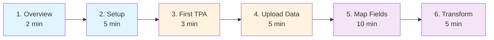

# 📚 Bordereau Documentation

> Complete documentation for the Bordereau Processing Pipeline

[]()
[]()
[]()

**Last Updated**: February 3, 2026

---

## 🗺️ Documentation Map

```
📚 Documentation
│
├── 📖 README.md (You are here)
│   └── Central navigation hub
│
├── 🚀 ../README.md
│   └── Quick start & overview
│
├── 🎓 GUIDE.md (50+ pages)
│   ├── Getting Started
│   ├── TPA Management
│   ├── Bronze Layer (Data Ingestion)
│   ├── Silver Layer (Transformation)
│   ├── Gold Layer (Analytics)
│   ├── Technical Reference
│   ├── Troubleshooting
│   ├── FAQ
│   └── Glossary
│
├── 🏗️ ARCHITECTURE.md
│   ├── System Architecture Diagram
│   ├── Entity Reference
│   ├── Data Flow
│   └── Design Principles
│
├── 📝 CHANGELOG.md
│   └── Documentation version history
│
└── 📊 OPTIMIZATION_SUMMARY.md
    └── Documentation improvements log
```

---

## 📖 Documentation Structure

| Document | Purpose | Pages | Audience | Reading Time |
|----------|---------|-------|----------|--------------|
| **[🚀 Quick Start](../README.md)** | Get started in 5 minutes | 1 | Everyone | 2 min |
| **[🎓 User Guide](GUIDE.md)** | Complete usage instructions | 50+ | End users, admins | 35 min |
| **[🏗️ Architecture](ARCHITECTURE.md)** | Technical design & data model | 10 | Developers, architects | 15 min |
| **[📝 Changelog](CHANGELOG.md)** | Documentation history | 5 | Maintainers | 5 min |
| **[📊 Optimization](OPTIMIZATION_SUMMARY.md)** | Improvement summary | 10 | Maintainers | 10 min |

---

## 🚀 Getting Started

**New to Bordereau?** Follow this learning path:

### 🎯 Learning Path (30 minutes)



| Step | Document | Section | Time |
|------|----------|---------|------|
| **1** | [README](../README.md) | Overview & Quick Start | 2 min |
| **2** | [User Guide](GUIDE.md#getting-started) | Prerequisites & Setup | 5 min |
| **3** | [User Guide](GUIDE.md#tpa-management) | Create First TPA | 3 min |
| **4** | [User Guide](GUIDE.md#bronze-layer---data-ingestion) | Upload Files | 5 min |
| **5** | [User Guide](GUIDE.md#silver-layer---transformation) | Map Fields (ML/LLM) | 10 min |
| **6** | [User Guide](GUIDE.md#3-execute-transformation) | Transform Data | 5 min |

**Total**: ~30 minutes from zero to analytics

---

## 📚 User Guide Sections

<table>
<tr>
<td width="50%">

### 🎓 [Getting Started](GUIDE.md#getting-started)
- ✅ Prerequisites & installation
- ✅ First-time setup (5 min)
- ✅ Quick start workflow
- ✅ Access UI & API

### 🏢 [TPA Management](GUIDE.md#tpa-management)
- 📖 What is a TPA?
- ➕ Adding new TPAs
- 📝 Naming conventions
- 🔒 Multi-tenancy & isolation

### 🥉 [Bronze Layer](GUIDE.md#bronze-layer---data-ingestion)
1. 📤 Upload files (CSV/Excel)
2. 👀 View raw data
3. 📊 Monitor processing
4. 📁 Manage file stages
5. ⏰ Automated tasks

### 🥈 [Silver Layer](GUIDE.md#silver-layer---transformation)
1. 📋 Define target schemas
2. 🔗 Map fields (3 methods)
   - 🤖 ML auto-mapping
   - 🧠 LLM semantic mapping
   - ✍️ Manual mapping
3. ⚙️ Execute transformations
4. 👀 View transformed data

</td>
<td width="50%">

### 🥇 [Gold Layer](GUIDE.md#gold-layer---analytics)
1. 📈 Analytics dashboard
2. ✅ Quality metrics
3. 📏 Transformation rules
4. 👤 Member 360 view
5. 🏥 Provider performance

### 🛠️ [Technical Reference](GUIDE.md#technical-reference)
- 💻 Technology stack
- 🚀 Table types & performance
- ⏰ Task automation
- 🔒 Security model
- 📊 Monitoring & logging
- 🚢 Deployment options
- ⭐ Best practices

### 🆘 [Troubleshooting](GUIDE.md#troubleshooting)
- 🔴 File not processing
- 🟠 Transformation failed
- 🟡 Mapping errors
- 🔵 Performance issues
- 🟢 Connection issues
- 📋 Common error messages
- 💬 FAQ (30+ questions)
- 📖 Glossary

</td>
</tr>
</table>

---

## 🏗️ Architecture Documentation

### [Architecture Overview](ARCHITECTURE.md)
- System architecture diagram (Mermaid)
- Entity relationships
- Data flow visualization

### [Entity Reference](ARCHITECTURE.md#entity-reference)
- Core entities (TPA, User, File)
- Bronze layer entities
- Silver layer entities
- Gold layer entities

### [Data Flow](ARCHITECTURE.md#data-flow)
- End-to-end processing pipeline
- State transitions
- Task orchestration

### [Design Principles](ARCHITECTURE.md#key-design-principles)
- TPA isolation
- Schema reusability
- Mapping flexibility
- Data quality
- Audit trail

---

## 🎯 Common Tasks (Quick Links)

<table>
<tr>
<td width="50%">

### 📤 Upload and Process Files
| Task | Link | Time |
|------|------|------|
| 1. Add TPA | [Guide](GUIDE.md#add-new-tpa) | 30s |
| 2. Upload Files | [Guide](GUIDE.md#1-upload-files) | 1 min |
| 3. Monitor Processing | [Guide](GUIDE.md#3-monitor-processing) | 1 min |

### 🔗 Map and Transform Data
| Task | Link | Time |
|------|------|------|
| 1. Define Schema | [Guide](GUIDE.md#1-define-target-schemas) | 2 min |
| 2. Auto-Map (ML) | [Guide](GUIDE.md#method-1-auto-map-with-ml-pattern-matching) | 1 min |
| 3. Auto-Map (LLM) | [Guide](GUIDE.md#method-2-auto-map-with-llm-semantic-understanding) | 2 min |
| 4. Manual Mapping | [Guide](GUIDE.md#method-3-manual-mapping) | varies |
| 5. Execute Transform | [Guide](GUIDE.md#3-execute-transformation) | 2 min |

</td>
<td width="50%">

### 📊 View Analytics
| Task | Link | Time |
|------|------|------|
| 1. Analytics Dashboard | [Guide](GUIDE.md#1-analytics-dashboard) | 30s |
| 2. Quality Metrics | [Guide](GUIDE.md#2-quality-metrics) | 30s |
| 3. View Silver Data | [Guide](GUIDE.md#4-view-transformed-data) | 30s |

### 🆘 Troubleshoot Issues
| Issue | Link | Priority |
|-------|------|----------|
| File Not Processing | [Guide](GUIDE.md#-file-not-processing) | 🔴 High |
| Transform Failed | [Guide](GUIDE.md#-transformation-failed) | 🔴 High |
| Mapping Errors | [Guide](GUIDE.md#-mapping-errors) | 🟡 Medium |
| Performance Issues | [Guide](GUIDE.md#-performance-issues) | 🔵 Low |
| Connection Issues | [Guide](GUIDE.md#-connection-issues) | 🔴 High |

</td>
</tr>
</table>

---

## 🔧 Deployment

### Local Development
```bash
./start.sh
```
**See**: [Deployment Options](GUIDE.md#deployment-options)

### Snowflake Database
```bash
cd deployment && ./deploy.sh YOUR_CONNECTION
```
**See**: [Option 2: Snowflake Database Only](GUIDE.md#option-2-snowflake-database-only)

### Snowpark Container Services
```bash
./build_and_push_ghcr.sh && cd deployment && ./deploy_container.sh YOUR_CONNECTION
```
**See**: [Option 3: Snowpark Container Services](GUIDE.md#option-3-snowpark-container-services-full-stack)

---

## 🆘 Quick Help

| Issue | Link |
|-------|------|
| Can't connect to Snowflake | [Connection Issues](GUIDE.md#connection-issues) |
| Files not processing | [File Not Processing](GUIDE.md#file-not-processing) |
| Transformation errors | [Transformation Failed](GUIDE.md#transformation-failed) |
| Slow performance | [Performance Issues](GUIDE.md#performance-issues) |
| Mapping problems | [Mapping Errors](GUIDE.md#mapping-errors) |

---

## 📊 Key Concepts

<table>
<tr>
<td width="50%">

### 🏗️ Medallion Architecture
```
Bronze (Raw)
   ↓
Silver (Transformed)
   ↓
Gold (Analytics)
```

| Layer | Purpose | Storage |
|-------|---------|---------|
| **🥉 Bronze** | Raw ingestion | Standard tables |
| **🥈 Silver** | Cleaned data | Hybrid tables (10-100x faster) |
| **🥇 Gold** | Analytics | Clustered tables (2-10x faster) |

### 🏢 Multi-Tenancy
```
TPA A → Separate folders, tables, mappings
TPA B → Separate folders, tables, mappings
TPA C → Separate folders, tables, mappings
```

**Features**:
- ✅ Complete TPA isolation
- ✅ Shared schemas, per-TPA tables
- ✅ Independent processing
- ✅ Cross-TPA analytics in Gold

</td>
<td width="50%">

### 🤖 AI-Powered Mapping

| Method | Accuracy | Speed | Cost |
|--------|----------|-------|------|
| **ML** | 70-85% | ⚡ Fast | 💰 Free |
| **LLM** | 85-95% | ⚡ Medium | 💰💰 Cortex |
| **Manual** | 100% | 🐌 Slow | 💰 Free |

**Algorithm Comparison**:
- **ML**: TF-IDF + SequenceMatcher + word overlap
- **LLM**: Snowflake Cortex AI (semantic understanding)
- **Manual**: Custom SQL transformations

### ✅ Data Quality

**Validation Flow**:
```
Record → Validation → PASS → Silver
                   → FAIL → Quarantine
```

**Features**:
- 📏 Configurable rules
- 🚫 REJECT, QUARANTINE, FLAG, CORRECT
- 📊 Quality metrics & trending
- 🔍 Failed record tracking

</td>
</tr>
</table>

---

## 🛠️ Technology Stack

**Frontend**: React 18, TypeScript 5, Ant Design 5, Vite 5  
**Backend**: Python 3.11, FastAPI, Uvicorn, Snowflake Connector  
**Database**: Snowflake (Hybrid Tables, Cortex AI, Snowpark)

**See**: [Technology Stack](GUIDE.md#technology-stack)

---

## 📝 Version History

| Version | Date | Changes |
|---------|------|---------|
| 3.3 | Feb 3, 2026 | Documentation consolidation and optimization |
| 3.2 | Feb 2, 2026 | UI/UX improvements, loading spinners, accordion views |
| 3.1 | Feb 1, 2026 | LLM auto-mapping, quality metrics, enhanced logging |
| 3.0 | Jan 2026 | Initial production release |

---

## 🎓 Additional Resources

### 📖 Reference Materials
- [FAQ (30+ questions)](GUIDE.md#frequently-asked-questions-faq)
- [Glossary](GUIDE.md#glossary)
- [Common Error Messages](GUIDE.md#-common-error-messages)
- [Best Practices](GUIDE.md#best-practices)

### 🔧 Technical Deep Dives
- [Architecture Diagram](ARCHITECTURE.md#system-architecture-diagram)
- [Entity Reference](ARCHITECTURE.md#entity-reference)
- [Data Flow](ARCHITECTURE.md#data-flow)
- [Design Principles](ARCHITECTURE.md#key-design-principles)

### 📝 Change History
- [Documentation Changelog](CHANGELOG.md)
- [Optimization Summary](OPTIMIZATION_SUMMARY.md)

---

## 🆘 Need Help?

| Resource | Link |
|----------|------|
| **Troubleshooting Guide** | [GUIDE.md#troubleshooting](GUIDE.md#troubleshooting) |
| **FAQ** | [GUIDE.md#frequently-asked-questions-faq](GUIDE.md#frequently-asked-questions-faq) |
| **Common Errors** | [GUIDE.md#-common-error-messages](GUIDE.md#-common-error-messages) |
| **Getting Help** | [GUIDE.md#-getting-help](GUIDE.md#-getting-help) |

---

## 📈 Documentation Stats

| Metric | Value |
|--------|-------|
| **Total Pages** | 75+ |
| **Total Words** | 15,000+ |
| **Sections** | 50+ |
| **Code Examples** | 100+ |
| **Tables** | 60+ |
| **Diagrams** | 10+ |
| **FAQ Questions** | 30+ |
| **Troubleshooting Scenarios** | 12+ |

---

**Version**: 3.3 | **Last Updated**: February 3, 2026 | **Status**: ✅ Production Ready

**Feedback**: Documentation improvements are ongoing. Suggestions welcome!
