# Bordereau Processing Pipeline - Documentation Hub

Welcome to the complete documentation for the Bordereau Processing Pipeline, a modern healthcare claims data processing system built with FastAPI, React, and Snowflake.

## 📚 Table of Contents

- [Quick Links](#quick-links)
- [Getting Started](#getting-started)
- [Architecture](#architecture)
- [User Guides](#user-guides)
- [Deployment](#deployment)
- [Development](#development)
- [Reference](#reference)

## 🚀 Quick Links

| Document | Description |
|----------|-------------|
| [Main README](../README.md) | Project overview and quick start |
| [Quick Start Guide](../QUICK_START.md) | Get running in 10 minutes |
| [Implementation Log](IMPLEMENTATION_LOG.md) | ⭐ Complete implementation history |
| [User Guide](USER_GUIDE.md) | Complete usage instructions |
| [Deployment Guide](../deployment/README.md) | Deployment to Snowflake and Snowpark |
| [Quick Reference](../deployment/QUICK_REFERENCE.md) | Quick deployment commands |
| [Migration Guide](../MIGRATION_GUIDE.md) | Streamlit to React migration notes |
| [Documentation Structure](../DOCUMENTATION_STRUCTURE.md) | Documentation organization (v4.0) |
| [Documentation Cleanup v3.4](DOCUMENTATION_CLEANUP_SUMMARY.md) | Major cleanup summary |
| [Documentation Cleanup v4.0](DOCUMENTATION_CLEANUP_V4.md) | ⭐ Final consolidation |

### Visual Documentation (with Mermaid Diagrams) 📊

| Document | Description |
|----------|-------------|
| [Diagrams Guide](DIAGRAMS_GUIDE.md) | How to use Mermaid diagrams |
| [Data Flow Diagrams](DATA_FLOW_DIAGRAMS.md) | Data flow visualizations |
| [Architecture Diagrams](ARCHITECTURE_DIAGRAMS.md) | System architecture diagrams |

## 🎯 Getting Started

### For End Users

1. **[User Guide](USER_GUIDE.md)** - Complete guide to using the application
   - Bronze layer file upload and processing
   - Silver layer transformation and mapping
   - TPA management
   - Monitoring and troubleshooting

2. **[TPA Complete Guide](guides/TPA_COMPLETE_GUIDE.md)** - Multi-tenant architecture
   - TPA concepts and setup
   - File organization
   - Data isolation

3. **[TPA Upload Guide](../bronze/TPA_UPLOAD_GUIDE.md)** - File upload conventions
   - File naming standards
   - Directory structure
   - Supported formats

### For Developers

1. **[Main README](../README.md)** - Architecture overview and local setup
2. **[Quick Start Guide](../QUICK_START.md)** - Fast setup for development
3. **[Backend README](../backend/README.md)** - FastAPI backend documentation
4. **[Frontend Setup](../frontend/README.md)** - React frontend setup

### For DevOps/Admins

1. **[Deployment Guide](../deployment/README.md)** - Complete deployment documentation
2. **[Deployment & Operations](DEPLOYMENT_AND_OPERATIONS.md)** - Operations guide
3. **[Test Plan](testing/TEST_PLAN_DEPLOYMENT_SCRIPTS.md)** - Deployment testing

## 🏗️ Architecture

### System Overview

```mermaid
graph TD
    A[Frontend React<br/>━━━━━━━━━━━━━━━<br/>• Vite + TypeScript + Ant Design<br/>• Bronze & Silver layer management] 
    B[Backend FastAPI<br/>━━━━━━━━━━━━━━━<br/>• REST API with Pydantic validation<br/>• Multi-auth support PAT, Keypair, Snow CLI]
    C[Snowflake Database<br/>━━━━━━━━━━━━━━━<br/>• Bronze Layer: Raw data ingestion<br/>• Silver Layer: Transformed data<br/>• Tasks: Automated processing]
    
    A -->|REST API| B
    B -->|Snowflake Connector| C
    
    style A fill:#61dafb,stroke:#333,stroke-width:2px,color:#000
    style B fill:#009688,stroke:#333,stroke-width:2px,color:#fff
    style C fill:#29b5e8,stroke:#333,stroke-width:2px,color:#fff
```



### Technology Stack

- **Frontend**: React 18, TypeScript, Vite, Ant Design
- **Backend**: FastAPI, Python 3.10+, Pydantic
- **Database**: Snowflake (Bronze & Silver layers)
- **Deployment**: Docker, Snowpark Container Services
- **Authentication**: Snow CLI, PAT, Keypair

## 📖 User Guides

### Bronze Layer (Raw Data Ingestion)

- **[Bronze README](../bronze/README.md)** - Bronze layer architecture
  - File discovery and processing
  - Stage management (SRC, COMPLETED, ERROR, ARCHIVE)
  - Task automation
  - TPA isolation

- **[TPA Upload Guide](../bronze/TPA_UPLOAD_GUIDE.md)** - File upload guide
  - File naming conventions
  - TPA directory structure
  - Upload methods

### Silver Layer (Data Transformation)

- **[Silver README](../silver/README.md)** - Silver layer architecture
  - Target schema management
  - Field mapping (Manual, ML, LLM)
  - Transformation rules engine
  - Data quality checks

### Complete Workflows

- **[User Guide](USER_GUIDE.md)** - End-to-end workflows
  - Uploading and processing files
  - Creating mappings
  - Running transformations
  - Monitoring and troubleshooting

- **[TPA Complete Guide](guides/TPA_COMPLETE_GUIDE.md)** - Multi-tenant patterns
  - TPA architecture
  - Data isolation
  - Management procedures

## 🚀 Deployment

### Deployment Options

1. **Local Development**
   ```bash
   ./start.sh  # Starts both backend and frontend
   ```

2. **Snowflake (Bronze & Silver Layers)**
   ```bash
   cd deployment
   ./deploy.sh
   ```

3. **Snowpark Container Services**
   ```bash
   cd deployment
   ./deploy_snowpark_container.sh
   ```

### Deployment Documentation

- **[Deployment README](../deployment/README.md)** - Complete deployment guide
  - All deployment scripts
  - Configuration options
  - Service management
  - Troubleshooting

- **[Deployment & Operations](DEPLOYMENT_AND_OPERATIONS.md)** - Operations guide
  - Verification procedures
  - Monitoring
  - Common issues

- **[Authentication Setup](../deployment/AUTHENTICATION_SETUP.md)** - Auth configuration
  - Snow CLI setup
  - PAT generation
  - Keypair authentication

### Deployment Scripts

| Script | Purpose |
|--------|---------|
| `deploy.sh` | Deploy Bronze + Silver layers |
| `deploy_bronze.sh` | Deploy Bronze layer only |
| `deploy_silver.sh` | Deploy Silver layer only |
| `deploy_snowpark_container.sh` | Deploy to Snowpark Container Services |
| `manage_snowpark_service.sh` | Manage Snowpark services |
| `undeploy.sh` | Remove all resources |

## 💻 Development

### Backend Development

**[Backend README](../backend/README.md)** - Complete backend documentation

- **Authentication Methods**:
  1. Snowflake Session Token (Snow CLI)
  2. Configuration File (PAT or Keypair)
  3. Snow CLI Connection
  4. Environment Variables

- **Running Locally**:
  ```bash
  cd backend
  source venv/bin/activate
  uvicorn app.main:app --reload
  ```

- **API Documentation**: http://localhost:8000/api/docs

### Frontend Development

- **Running Locally**:
  ```bash
  cd frontend
  npm install
  npm run dev
  ```

- **Access**: http://localhost:3000

### Sample Data Generator

**NEW**: Generate realistic healthcare data for testing and development!

- **[Sample Data README](../sample_data/README.md)** - Complete guide
- **Quick Start**: `cd sample_data && ./quick_start.sh 5000`
- **Features**:
  - Members, providers, claims
  - Member journeys and events
  - Realistic healthcare patterns
  - Zero external dependencies

### Project Structure

```
bordereau/
├── backend/                 # FastAPI backend
│   ├── app/
│   │   ├── api/            # API endpoints
│   │   ├── services/       # Business logic
│   │   ├── config.py       # Configuration
│   │   └── main.py         # FastAPI app
│   └── requirements.txt
├── frontend/               # React frontend
│   ├── src/
│   │   ├── pages/         # Page components
│   │   ├── services/      # API client
│   │   └── types/         # TypeScript types
│   └── package.json
├── bronze/                # Bronze layer SQL
├── silver/                # Silver layer SQL
├── gold/                  # Gold layer SQL (analytics)
├── sample_data/           # Sample data generator
├── deployment/            # Deployment scripts
├── docker/                # Docker configs
└── docs/                  # Documentation (you are here)
```

## 📋 Reference

### Implementation History

- **[Implementation Log](IMPLEMENTATION_LOG.md)** - Complete implementation history
  - Initial deployment summary
  - Hybrid tables implementation
  - Gold layer implementation
  - Frontend features added
  - Documentation consolidation

### Sample Data

- **[Sample Data README](../sample_data/README.md)** - Sample files and configurations
  - Claims data for testing
  - Pre-configured mappings
  - Transformation rules

### SQL Layer Documentation

- **[Bronze Layer](../bronze/README.md)**
  - Schema and tables
  - Stored procedures
  - Tasks and automation

- **[Silver Layer](../silver/README.md)**
  - Target schemas
  - Mapping procedures
  - Rules engine
  - Transformation logic

- **[Gold Layer](../gold/README.md)**
  - Analytics tables
  - Business metrics
  - Quality rules
  - Transformation procedures

- **[Hybrid Tables Guide](../gold/HYBRID_TABLES_GUIDE.md)**
  - Hybrid vs standard tables
  - Performance optimization
  - Best practices

### Configuration

- **Backend Configuration**:
  - `backend/config.toml` - Snowflake credentials
  - `backend/config.py` - Application settings
  - Environment variables

- **Deployment Configuration**:
  - `deployment/default.config` - Default settings
  - `deployment/custom.config` - Custom overrides

### API Reference

Interactive API documentation available when backend is running:
- **Swagger UI**: http://localhost:8000/api/docs
- **ReDoc**: http://localhost:8000/api/redoc

### Testing

- **[Deployment Test Plan](testing/TEST_PLAN_DEPLOYMENT_SCRIPTS.md)** - Deployment testing
  - Test scenarios
  - Verification procedures
  - Expected results

## 🔧 Troubleshooting

### Common Issues

**Backend won't start**
- Check Snowflake credentials in config
- Verify Python version (3.10+)
- Review logs: `logs/backend.log`

**Frontend won't connect**
- Ensure backend is running on port 8000
- Check CORS settings in `backend/app/config.py`
- Verify API URL in frontend

**File upload fails**
- Check TPA exists in `TPA_MASTER`
- Verify stage permissions
- Review Bronze layer logs

**Transformation fails**
- Check field mappings are approved
- Review quarantine records
- Verify target table exists

### Getting Help

1. Check the [User Guide](USER_GUIDE.md) for usage questions
2. Review [Deployment & Operations](DEPLOYMENT_AND_OPERATIONS.md) for deployment issues
3. Check API documentation at `/api/docs` for endpoint details
4. Review SQL layer READMEs for database issues

## 📝 Migration Notes

**[Migration Guide](../MIGRATION_GUIDE.md)** - Streamlit to React migration

If you're migrating from the original Streamlit implementation:
- Snowflake layers remain unchanged
- New React + FastAPI architecture
- All features preserved
- Better scalability and performance

## 🔐 Security

### Best Practices

1. **Never commit credentials** to version control
2. **Use PAT or Keypair** authentication in production
3. **Rotate tokens regularly**
4. **Set file permissions**: `chmod 600 config.toml`
5. **Use HTTPS** in production
6. **Monitor API access** logs

### Authentication Priority

1. Snowflake Session Token (Snow CLI) - Recommended for dev
2. Configuration File (PAT/Keypair) - Recommended for prod
3. Snow CLI Connection
4. Environment Variables

## 📊 Monitoring

### Health Checks

```bash
# Backend health
curl http://localhost:8000/api/health

# Snowflake connection
snow connection test
```

### Key Metrics

- File processing queue length
- Task execution status
- Transformation success rate
- Quarantine record count
- API response times

## 🎓 Learning Path

### For New Users

1. Read [Main README](../README.md) for overview
2. Follow [Quick Start Guide](../QUICK_START.md) to deploy
3. Review [User Guide](USER_GUIDE.md) for usage
4. Explore [TPA Complete Guide](guides/TPA_COMPLETE_GUIDE.md)

### For Developers

1. Review architecture in [Main README](../README.md)
2. Set up local environment with [Quick Start](../QUICK_START.md)
3. Study [Backend README](../backend/README.md)
4. Explore API docs at `/api/docs`

### For DevOps

1. Review [Deployment Guide](../deployment/README.md)
2. Study [Deployment & Operations](DEPLOYMENT_AND_OPERATIONS.md)
3. Test with [Test Plan](testing/TEST_PLAN_DEPLOYMENT_SCRIPTS.md)
4. Configure authentication per [Auth Setup](../deployment/AUTHENTICATION_SETUP.md)

---

**Version**: 1.0  
**Last Updated**: January 19, 2026  
**Status**: ✅ Production Ready

For the latest updates and changes, see the main [README](../README.md).
