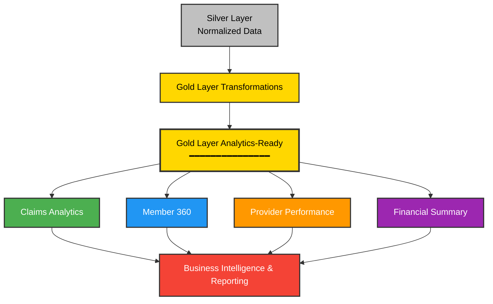

# Gold Layer

The Gold layer represents the final, business-ready data layer in the Bordereau Processing Pipeline. It contains aggregated, transformed, and analytics-ready data optimized for reporting, dashboards, and business intelligence.

## Purpose

The Gold layer serves as the **single source of truth** for business analytics and reporting by:

- **Aggregating** data from the Silver layer into business-friendly formats
- **Applying** business rules and calculations
- **Ensuring** data quality through automated checks
- **Providing** pre-calculated metrics and KPIs
- **Enabling** fast query performance for analytics

## Architecture



## Gold Layer Tables

### 1. CLAIMS_ANALYTICS_ALL
Aggregated claims data with key metrics and dimensions.

**Key Metrics:**
- Total billed, allowed, and paid amounts
- Claim counts and member counts
- Average amounts per claim
- Discount rates

**Dimensions:**
- Time (year, month)
- Claim type (Medical, Dental, Pharmacy)
- Provider
- TPA

**Refresh**: Daily

### 2. MEMBER_360_ALL
Comprehensive 360-degree view of member data.

**Key Metrics:**
- Total claims and paid amounts by type
- Risk scores
- Lifetime value

**Dimensions:**
- Member demographics (age, gender, state)
- Enrollment information
- Last activity date

**Refresh**: Daily

### 3. PROVIDER_PERFORMANCE_ALL
Provider performance metrics and KPIs.

**Key Metrics:**
- Cost per member
- Cost per claim
- Discount rates
- Quality scores
- Readmission rates

**Dimensions:**
- Provider (ID, name, specialty, type)
- Measurement period
- TPA

**Refresh**: Weekly

### 4. FINANCIAL_SUMMARY_ALL
Financial summary and analytics.

**Key Metrics:**
- Total billed, allowed, and paid
- PMPM (Per Member Per Month)
- Medical Loss Ratio (MLR)
- Member responsibility

**Dimensions:**
- Fiscal period (year, month, quarter)
- Claim type
- TPA

**Refresh**: Monthly

## SQL Files

### Execution Order

1. **1_Gold_Schema_Setup.sql** - Creates Gold schema, stages, and metadata tables
2. **2_Gold_Target_Schemas_BULK.sql** - Defines target table structures (optimized) ⚡
   - *Alternative: 2_Gold_Target_Schemas.sql (original, slower)*
3. **3_Gold_Transformation_Rules.sql** - Defines business rules and transformations
4. **4_Gold_Transformation_Procedures.sql** - Creates transformation stored procedures
5. **5_Gold_Tasks.sql** - Sets up automated refresh tasks

**⚡ Recommended:** Use `2_Gold_Target_Schemas_BULK.sql` for 88% faster execution!

### File Descriptions

#### 1_Gold_Schema_Setup.sql
- Creates GOLD schema
- Creates stages (@GOLD_STAGE, @GOLD_CONFIG)
- Creates 8 metadata tables:
  - `target_schemas` - Target table definitions
  - `target_fields` - Field definitions
  - `transformation_rules` - Business rules
  - `field_mappings` - Silver to Gold mappings
  - `quality_rules` - Data quality checks
  - `processing_log` - Processing history
  - `quality_check_results` - Quality check results
  - `business_metrics` - KPI definitions

#### 2_Gold_Target_Schemas_BULK.sql (Recommended ⚡)
- Defines 4 target table schemas
- Uses bulk INSERT for 88% faster execution
- Creates actual target tables
- **Performance**: 8 operations vs 69 in original

#### 2_Gold_Target_Schemas.sql (Original)
- Same functionality as bulk version
- Uses individual procedure calls (slower)
- Kept for compatibility
- **Performance**: 69 procedure calls

**See [BULK_LOAD_OPTIMIZATION.md](BULK_LOAD_OPTIMIZATION.md) for details**

#### 3_Gold_Transformation_Rules.sql
- Defines 11 transformation rules
- Defines 5 quality rules
- Defines 5 business metrics

#### 4_Gold_Transformation_Procedures.sql
- `transform_claims_analytics()` - Transform claims data
- `transform_member_360()` - Transform member data
- `execute_quality_checks()` - Run quality checks
- `run_gold_transformations()` - Master transformation procedure

#### 5_Gold_Tasks.sql
- Creates 4 automated tasks
- Creates monitoring views
- Schedules daily/weekly/monthly refreshes

## Transformation Flow

### Claims Analytics
```sql
Silver.CLAIMS_* 
  → Aggregate by year, month, type, provider
  → Calculate discount rates
  → Calculate averages
  → Gold.CLAIMS_ANALYTICS_ALL
```

### Member 360
```sql
Silver.CLAIMS_*
  → Aggregate by member
  → Calculate age from DOB
  → Calculate risk score
  → Gold.MEMBER_360_ALL
```

### Quality Checks
```sql
Gold Tables
  → Validate negative amounts
  → Check required fields
  → Verify discount rate ranges
  → Check consistency
  → Log results
```

## Data Quality

### Quality Rules

1. **Validity Checks**
   - No negative amounts
   - Discount rate between 0-1
   - Valid date ranges

2. **Completeness Checks**
   - Required fields populated
   - No null keys
   - Complete records

3. **Consistency Checks**
   - Claim counts match sum of types
   - Amounts reconcile
   - Cross-table consistency

4. **Timeliness Checks**
   - Data freshness (< 24 hours)
   - Processing SLAs met

### Quality Actions

- **REJECT** - Critical issues, block processing
- **FLAG** - Mark for review
- **LOG** - Record for monitoring
- **ALERT** - Notify stakeholders

## Business Metrics

### Financial Metrics
- Total Healthcare Spend
- Average Cost Per Member
- PMPM (Per Member Per Month)
- Medical Loss Ratio

### Operational Metrics
- Member Engagement Rate
- Provider Network Efficiency
- Claims Processing Time

### Clinical Metrics
- High Risk Member Count
- Readmission Rates
- Quality Scores

## Deployment

### Deploy Gold Layer

```bash
cd deployment
./deploy_gold.sh
```

Or deploy all layers:

```bash
./deploy.sh  # Includes Bronze, Silver, and Gold
```

### Manual Deployment

```sql
-- Set environment variables
SET DATABASE_NAME = 'BORDEREAU_PROCESSING_PIPELINE';
SET SILVER_SCHEMA_NAME = 'SILVER';
SET GOLD_SCHEMA_NAME = 'GOLD';

-- Execute scripts in order
@gold/1_Gold_Schema_Setup.sql
@gold/2_Gold_Target_Schemas.sql
@gold/3_Gold_Transformation_Rules.sql
@gold/4_Gold_Transformation_Procedures.sql
@gold/5_Gold_Tasks.sql
```

## Usage

### Run Transformations

```sql
-- Transform all Gold tables
CALL run_gold_transformations('ALL');

-- Transform specific table
CALL transform_claims_analytics('ALL');
CALL transform_member_360('ALL');

-- Run quality checks
CALL execute_quality_checks('CLAIMS_ANALYTICS_ALL', 'ALL');
```

### Query Gold Data

```sql
-- Claims analytics by month
SELECT 
    claim_year,
    claim_month,
    claim_type,
    SUM(total_paid_amount) AS total_paid,
    SUM(claim_count) AS claims
FROM CLAIMS_ANALYTICS_ALL
WHERE claim_year = 2024
GROUP BY claim_year, claim_month, claim_type
ORDER BY claim_year, claim_month;

-- High risk members
SELECT 
    member_id,
    member_name,
    risk_score,
    total_paid,
    total_claims
FROM MEMBER_360_ALL
WHERE risk_score >= 4
ORDER BY total_paid DESC;

-- Provider performance
SELECT 
    provider_name,
    provider_specialty,
    unique_members,
    total_paid,
    avg_cost_per_member,
    quality_score
FROM PROVIDER_PERFORMANCE_ALL
WHERE measurement_period = '2024-Q1'
ORDER BY avg_cost_per_member DESC;
```

### Monitor Processing

```sql
-- View task history
SELECT * FROM v_task_history
WHERE task_name LIKE 'task_%'
ORDER BY scheduled_time DESC
LIMIT 10;

-- View processing summary
SELECT * FROM v_gold_processing_summary
ORDER BY last_run_time DESC;

-- View quality check summary
SELECT * FROM v_quality_check_summary
WHERE failed_count > 0;
```

## Automated Tasks

### Task Schedule

| Task | Schedule | Description |
|------|----------|-------------|
| `task_master_gold_refresh` | Daily 1 AM EST | Master refresh of all Gold tables |
| `task_refresh_claims_analytics` | Daily 2 AM EST | Refresh claims analytics |
| `task_refresh_member_360` | Daily 3 AM EST | Refresh member 360 |
| `task_quality_checks` | Daily 4 AM EST | Run quality checks |

### Enable/Disable Tasks

```sql
-- Enable tasks
ALTER TASK task_master_gold_refresh RESUME;

-- Disable tasks
ALTER TASK task_master_gold_refresh SUSPEND;

-- Check task status
SHOW TASKS IN SCHEMA GOLD;
```

## Monitoring

### Key Metrics to Monitor

1. **Processing Success Rate**
   ```sql
   SELECT 
       status,
       COUNT(*) AS run_count,
       COUNT(*) * 100.0 / SUM(COUNT(*)) OVER () AS percentage
   FROM processing_log
   WHERE start_time >= DATEADD(DAY, -7, CURRENT_TIMESTAMP())
   GROUP BY status;
   ```

2. **Quality Check Pass Rate**
   ```sql
   SELECT 
       table_name,
       SUM(records_passed) * 100.0 / SUM(records_checked) AS pass_rate
   FROM quality_check_results
   WHERE check_timestamp >= DATEADD(DAY, -7, CURRENT_TIMESTAMP())
   GROUP BY table_name;
   ```

3. **Processing Duration**
   ```sql
   SELECT 
       table_name,
       AVG(duration_seconds) AS avg_duration,
       MAX(duration_seconds) AS max_duration
   FROM processing_log
   WHERE status = 'COMPLETED'
       AND start_time >= DATEADD(DAY, -7, CURRENT_TIMESTAMP())
   GROUP BY table_name;
   ```

## Table Types

The Gold layer uses two types of tables for optimal performance:

### Hybrid Tables (Metadata)
- **6 metadata tables** with **18 indexes**
- Fast point queries and lookups
- Support for row-level operations
- Tables: `target_schemas`, `target_fields`, `transformation_rules`, `field_mappings`, `quality_rules`, `business_metrics`

### Standard Tables (Analytics)
- **4 analytics tables** with **clustering keys**
- Optimized for analytical queries
- Large-scale aggregations
- Tables: `CLAIMS_ANALYTICS_ALL`, `MEMBER_360_ALL`, `PROVIDER_PERFORMANCE_ALL`, `FINANCIAL_SUMMARY_ALL`

**See [HYBRID_TABLES_GUIDE.md](HYBRID_TABLES_GUIDE.md) for detailed information.**

## Best Practices

1. **Incremental Processing**
   - Process only changed data when possible
   - Use watermarks for incremental loads

2. **Quality First**
   - Always run quality checks before publishing
   - Set appropriate thresholds

3. **Performance Optimization**
   - Hybrid tables: Use indexes for point queries
   - Standard tables: Use clustering keys for analytics
   - Monitor clustering depth and overlaps
   - Partition by date for time-series data

4. **Monitoring**
   - Set up alerts for failed tasks
   - Monitor processing duration trends
   - Track quality metrics over time

5. **Documentation**
   - Document all business rules
   - Maintain calculation logic
   - Keep data dictionary updated

## Troubleshooting

### Common Issues

1. **Task Failures**
   ```sql
   -- Check error messages
   SELECT * FROM v_task_history
   WHERE state = 'FAILED'
   ORDER BY scheduled_time DESC;
   ```

2. **Quality Check Failures**
   ```sql
   -- View failed checks
   SELECT * FROM v_quality_check_summary
   WHERE failed_count > 0;
   ```

3. **Performance Issues**
   ```sql
   -- Check long-running processes
   SELECT * FROM processing_log
   WHERE duration_seconds > 300
   ORDER BY duration_seconds DESC;
   ```

## Related Documentation

- [Bronze Layer README](../bronze/README.md)
- [Silver Layer README](../silver/README.md)
- [Deployment Guide](../deployment/README.md)
- [User Guide](../docs/USER_GUIDE.md)

---

**Version**: 1.0  
**Last Updated**: January 19, 2026  
**Status**: ✅ Ready for Deployment
